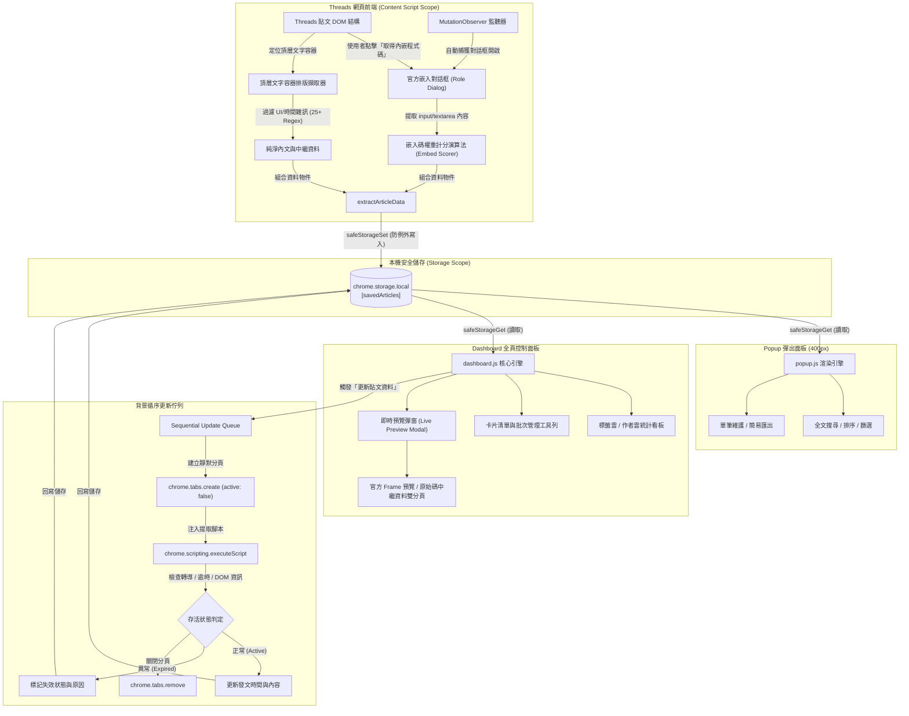
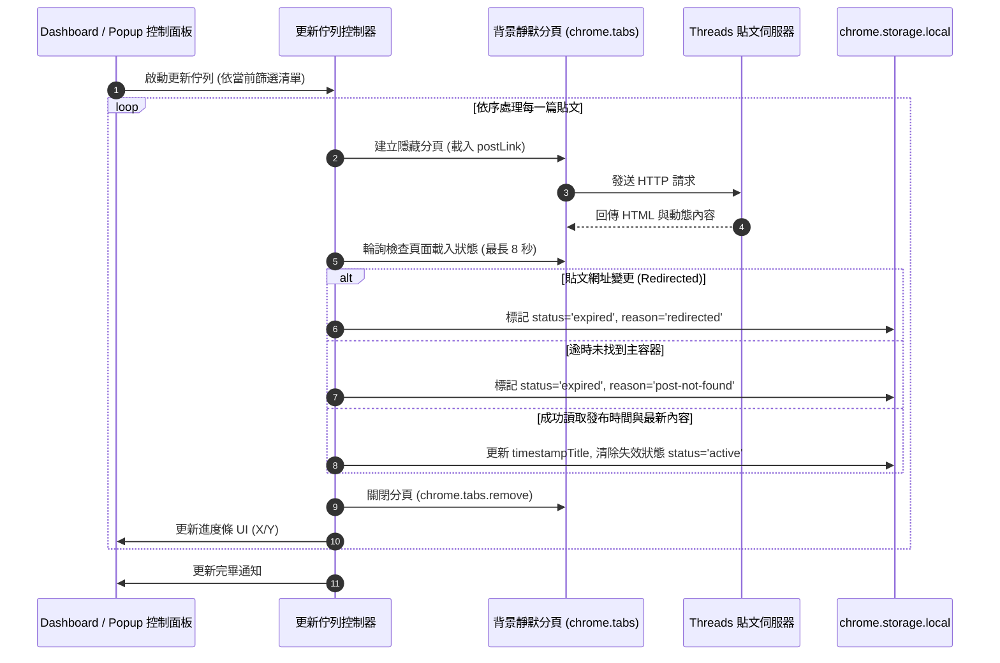
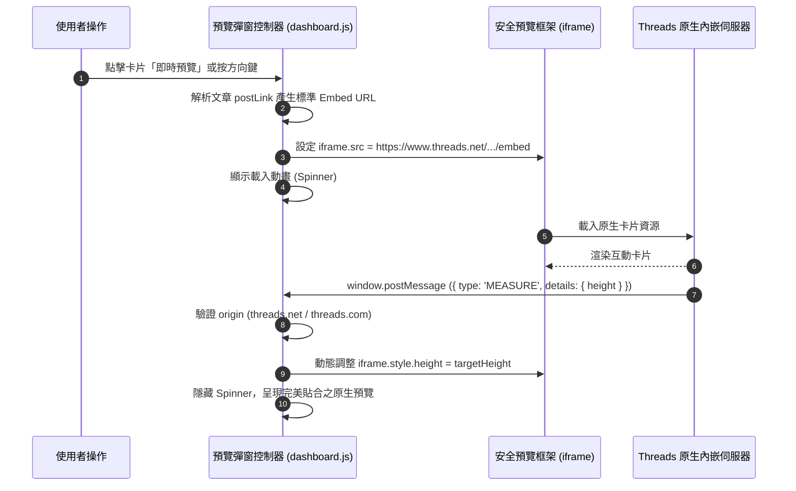

<div align="center">

# Threads 程式碼儲存器 (Threads Code Saver)

**自動擷取、清理、管理與匯出 Threads 貼文中的可嵌入程式碼與中繼資料**

[](./manifest.json)
[](https://developer.chrome.com/docs/extensions/mv3/intro/)
[](./README.md#授權條款)
[](#技術規格與技術棧)
[](#前置條件與環境需求)
[](#技術規格與技術棧)
[](https://github.com/Scorpio-meow/Threads-Featured-Posts)

---

基於 Google Chrome Manifest V3 標準設計的輕量級瀏覽器擴充功能。  
純前端架構、零外部依賴 — 所有資料均安全儲存於瀏覽器本機的 `chrome.storage.local`，  
無需任何後端伺服器、外部資料庫或第三方 API 金鑰，完整保障您的隱私與資料安全。

</div>

---

## 目錄

- [專案簡介與核心價值](#專案簡介與核心價值)
- [生態系與關聯專案](#生態系與關聯專案)
- [快速開始](#快速開始)
  - [前置條件與環境需求](#前置條件與環境需求)
  - [安裝與載入擴充功能](#安裝與載入擴充功能)
  - [基本操作流程](#基本操作流程)
- [核心功能特性](#核心功能特性)
  - [1. 智慧攔截與安全儲存](#1-智慧攔截與安全儲存)
  - [2. 頂層排版保留與深層文本清洗](#2-頂層排版保留與深層文本清洗)
  - [3. 多維度結構化欄位提取](#3-多維度結構化欄位提取)
  - [4. 控制面板即時預覽 (Live Preview)](#4-控制面板即時預覽-live-preview)
  - [5. 背景循序同步與失效監控佇列](#5-背景循序同步與失效監控佇列)
  - [6. 雙檢視介面與全方位批次操作](#6-雙檢視介面與全方位批次操作)
  - [7. 互動式標籤與作者統計雲](#7-互動式標籤與作者統計雲)
  - [8. 智慧容錯匯入與多格式匯出](#8-智慧容錯匯入與多格式匯出)
- [技術規格與技術棧](#技術規格與技術棧)
- [專案目錄與模組架構](#專案目錄與模組架構)
  - [專案檔案結構](#專案檔案結構)
  - [檔案職責對照表](#檔案職責對照表)
- [系統架構與流程圖](#系統架構與流程圖)
  - [整體系統架構圖](#整體系統架構圖)
  - [背景同步與失效恢復流程圖](#背景同步與失效恢復流程圖)
  - [即時預覽安全通訊協定圖](#即時預覽安全通訊協定圖)
- [核心演算法與技術實作細節](#核心演算法與技術實作細節)
  - [1. 頂層文字容器排版擷取演算法](#1-頂層文字容器排版擷取演算法)
  - [2. 嵌入碼對話框權重評分演算法](#2-嵌入碼對話框權重評分演算法)
  - [3. 多模態程式碼區塊識別機制](#3-多模態程式碼區塊識別機制)
  - [4. 25+ 模式 UI 雜訊與時間過濾鏈](#4-25-模式-ui-雜訊與時間過濾鏈)
  - [5. 非同步循序更新佇列與工作分頁架構](#5-非同步循序更新佇列與工作分頁架構)
  - [6. 即時預覽動態高度自適應通訊](#6-即時預覽動態高度自適應通訊)
- [資料模型與儲存 Schema](#資料模型與儲存-schema)
  - [SavedArticle 介面定義](#savedarticle-介面定義)
  - [CodeBlock 介面定義](#codeblock-介面定義)
  - [儲存空間管理](#儲存空間管理)
- [配置與權限宣告](#配置與權限宣告)
  - [權限清單與使用目的](#權限清單與使用目的)
  - [內容安全政策 (CSP) 規範](#內容安全政策-csp-規範)
- [備份、匯出與匯入規範](#備份匯出與匯入規範)
  - [匯出格式對比與規範](#匯出格式對比與規範)
  - [匯出檔案範例](#匯出檔案範例)
  - [智慧匯入解析機制](#智慧匯入解析機制)
- [操作指南與快捷鍵速查](#操作指南與快捷鍵速查)
  - [控制面板即時預覽快捷鍵](#控制面板即時預覽快捷鍵)
  - [儀表板常用操作對照表](#儀表板常用操作對照表)
- [常見問題與疑難排解 (FAQ)](#常見問題與疑難排解-faq)
- [開發與貢獻指南](#開發與貢獻指南)
  - [開發與修改流程](#開發與修改流程)
  - [開發注意事項與架構規範](#開發注意事項與架構規範)
- [版本更新紀錄 (Changelog)](#版本更新紀錄-changelog)
- [AI 友善文件說明 (llms.txt)](#ai-友善文件說明-llmstxt)
- [授權條款與免責聲明](#授權條款與免責聲明)

---

## 專案簡介與核心價值

Threads 平台上有大量優質的程式設計分享與技術短文，然而官方原生介面未提供程式碼片段的收藏管理、格式化匯出與本地檢索工具。

「**Threads 程式碼儲存器**」為解決此痛點而生，具備以下核心價值：

| 核心價值 | 說明 |
| :--- | :--- |
| **無感自動擷取** | 只要在貼文點擊「取得內嵌程式碼」，擴充功能即自動在背景完成中繼資料與程式碼提取。 |
| **原始排版保真** | 採用頂層文字容器分析演算法，完整保留段落換行與程式碼縮排，徹底告別換行被壓平的困擾。 |
| **多層雜訊過濾** | 內建 25 種以上過濾正規表達式，自動剝離作者簡介、相對發文時間、輪播計數及平台導覽文字。 |
| **離線安全隱私** | 資料 100% 留存於瀏覽器本機儲存區，不建立任何外部通訊，無追蹤、無遙測、無隱私疑慮。 |
| **靈活跨端複用** | 提供標準 HTML 內嵌碼、JSON 結構化資料、精選 JavaScript 配置檔等三種匯出格式，無縫串接個人網站或筆記庫。 |

---

## 生態系與關聯專案

本專案作為「**資料擷取與本機管理中樞**」，與前端展示專案 **[Threads-Featured-Posts](https://github.com/Scorpio-meow/Threads-Featured-Posts)** 構成完整的 Threads 內容收藏與公開展示生態系：

| 專案名稱 | 專案定位與職責 | 專案連結 |
| :--- | :--- | :--- |
| **Threads 程式碼儲存器** (本專案) | 瀏覽器擴充功能：負責 Threads 貼文智慧擷取、DOM 雜訊清洗、本機儲存、即時預覽與多格式匯出 | [GitHub 專案庫](https://github.com/Scorpio-meow/threads-embedded-code) |
| **Threads 精選貼文展示** (關聯專案) | 前端展示網站：接收本擴充功能匯出的「精選貼文資料 (`threads-featured-data-*.js`)」，提供響應式卡片流與展示介面 | [GitHub 專案庫](https://github.com/Scorpio-meow/Threads-Featured-Posts) |

### 雙專案協同運作流程

```
[在 Threads 瀏覽貼文] ──> [Threads 程式碼儲存器 (擴充功能)]
                                    │
                                    ▼ (點擊「匯出精選資料」)
                    [產出 threads-featured-data-*.js]
                                    │
                                    ▼ (作為資料來源引用)
                      [Threads-Featured-Posts 前端展示網站]
```

1. 在日常瀏覽 Threads 時，使用 **Threads 程式碼儲存器** 一鍵收藏優質程式碼與技術筆記。
2. 於控制面板中點擊「**匯出精選資料**」，擴充功能會自動去除作者帳號 `@` 前綴並格式化為前端配置物件。
3. 將匯出的檔案直接提供給 **[Threads-Featured-Posts](https://github.com/Scorpio-meow/Threads-Featured-Posts)** 專案作為資料來源，即刻完成個人技術精選貼文網站的更新與展示。

---

## 快速開始

### 前置條件與環境需求

- 支援 Manifest V3 的 Chromium 核心瀏覽器：
  - Google Chrome (版本 88 以上)
  - Microsoft Edge (版本 88 以上)
  - Brave Browser
  - Opera / Opera GX
  - Arc Browser
- 純前端原生專案，不需安裝任何額外編譯環境、執行環境或打包工具。

### 安裝與載入擴充功能

1. 取得專案原始碼：
   ```bash
   git clone https://github.com/Scorpio-meow/threads-embedded-code.git
   cd threads-embedded-code
   ```
2. 開啟瀏覽器並進入擴充功能管理頁面：
   - Google Chrome 請於網址列輸入：`chrome://extensions/`
   - Microsoft Edge 請於網址列輸入：`edge://extensions/`
3. 開啟頁面右上角的「**開發人員模式** (Developer mode)」。
4. 點擊左上角的「**載入未封裝項目** (Load unpacked)」。
5. 選取本專案的根目錄（即包含 [manifest.json](./manifest.json) 的資料夾）。
6. 在瀏覽器工具列的擴充功能圖示清單中，將「Threads 程式碼儲存器」釘選至工具列。

### 基本操作流程

```
[瀏覽 Threads 貼文] ──> [點擊「...」選單] ──> [選擇「取得內嵌程式碼」]
                                                    │
                                                    ▼
[資料自動提取並儲存] <── [綠色成功提示浮現] <── [自動攔截嵌入對話框]
        │
        ├──> [點擊工具列圖示] ────> 開啟 Popup 彈出面板 (快速檢索 / 排序 / 匯出)
        │
        └──> [點擊「控制面板」] ──> 開啟全螢幕 Dashboard (即時預覽 / 批次管理 / 標籤雲)
```

---

## 核心功能特性

### 1. 智慧攔截與安全儲存
- **DOM 變更監聽**：透過 `MutationObserver` 監控頁面 DOM 結構，搭配 5 秒週期性檢查，無縫捕捉使用者點擊「取得內嵌程式碼」所開啟的對話框。
- **主動式偵測機制**：透過 [processOpenEmbedDialogs](./content.js#L473-L513) 函式，即使對話框由非擴充功能按鈕開啟，也能自動解析對話框中的唯讀輸入框並儲存。
- **上下文保護封裝**：內建 [safeStorageGet](./content.js#L20-L31) 與 [safeStorageSet](./content.js#L32-L43)，自動檢查擴充功能執行環境生命週期（[isExtensionAlive](./content.js#L13-L19)），避免擴充功能更新或重載時拋出未捕獲的 `Extension context invalidated` 例外。

### 2. 頂層排版保留與深層文本清洗
- **原生排版與換行保留**：使用頂層文字容器 `innerText` 擷取策略，完整保留文章的自然段落換行（`\n`）與 `<br>` 標籤，解決傳統遍歷子節點時將多行內文壓縮為單行空格的問題，並確保同行的 `@提及` 與 `#標籤` 保持排版連貫。
- **UI 與時間雜訊深度過濾**：自動識別並清除作者簡介、追蹤者人數、串文數量、相對時間（如「2天」、「1小時」、「剛剛」）以及各類平台引導文字。支援 25 種以上繁體中文與英文介面模式。
- **嚴格排除標頭連結**：精確過濾 `time` 標籤、`a[href*="/post/"]`、`a[href*="/t/"]` 貼文永久連結與 `a[href*="/@"]` 作者主頁連結，防止中繼標籤誤混入文章主體。
- **回覆邊界隔離**：在動態牆或個人首頁擷取時，偵測到「回覆...」邊界元素時自動切斷，確保僅擷取發文者所發布的主內容。
- **純圖片說明過濾**：透過 [isLikelyImageOnlyDescription](./content.js#L228-L235) 智慧判別僅含圖片說明的貼文（如 `Photo by ... on ...`），避免無效擷取。

### 3. 多維度結構化欄位提取
系統會將每篇貼文完整解析為標準化的結構化資料物件：

| 欄位名稱 | 類型 | 說明 |
| :--- | :--- | :--- |
| **貼文內文** | `string` | 經過去除 UI 雜訊與中繼標籤後的純文字（保留完整段落換行） |
| **發文作者** | `string` | 發文者帳號（格式為 `@username`） |
| **作者主頁** | `string` | 發文者的 Threads 個人主頁完整網址 |
| **發文時間** | `string` | 包含標準 ISO 8601 時間字串與格式化標題文字 |
| **標籤清單** | `string[]` | 結合官方 Hashtag 與內文技術關鍵字自動映射的標籤陣列 |
| **程式碼區塊** | `CodeBlock[]` | 解析出的 Markdown 圍欄、HTML Pre/Code、Monospace 與行內代碼 |
| **內嵌代碼** | `string` | Threads 官方原生的標準 `<blockquote>` 嵌入代碼 |
| **貼文狀態** | `'active' \| 'expired'` | 標記貼文為正常存取中或已失效 |

### 4. 控制面板即時預覽 (Live Preview)
- **雙分頁即時渲染**：
  - **原生內嵌預覽 (Official Embed)**：遵循 Chrome Manifest V3 與 Threads 官方嵌入規範，透過安全 Frame 直接載入官方即時卡片，呈現完整的互動按鈕與動態樣式。
  - **原始碼與中繼資料 (Embed Code & Metadata)**：直接檢視乾淨的 `<blockquote>` 代碼與貼文中繼屬性對照表格。
- **多裝置標準寬度切換**：
  - **官方預設 (658px)**：符合 Threads 官方標準寬度（高度依貼文內容自適應）。
  - **平板檢視 (480px)**：模擬平板直向顯示效果。
  - **手機檢視 (320px)**：符合 Threads 官方最小支援寬度。
  - **自適應寬度 (100%)**：填滿預覽容器空間。
- **全方位快捷鍵與導覽**：支援鍵盤 `ESC` 關閉、`←` / `→` 方向鍵無縫切換上一篇/下一篇貼文、一鍵複製程式碼、一鍵複製內嵌碼及直接開啟原文。

### 5. 背景循序同步與失效監控佇列
- **循序非同步更新**：點擊「更新貼文資料」時，系統會依照當前篩選與排序後的結果建立佇列，以單一工作分頁循序開啟進行同步，有效避免多開分頁導致的系統卡頓或平台流量限制。
- **進度與中斷控制**：即時顯示「更新中 (X/Y)」進度條與百分比動畫，並提供「**暫停 / 繼續**」與「**取消**」功能按鈕。
- **智慧失效標記與自動恢復**：
  - 若貼文被刪除、轉為私密或發生轉導（`redirected`），系統將自動標記為 `expired` 並記錄原因。
  - 若頁面載入逾時（8 秒內未找到貼文容器 `[data-pressable-container]`），將記錄為 `post-not-found`。
  - 若下次更新時貼文恢復可存取狀態，系統會自動清除失效標籤並恢復為 `active`。

### 6. 雙檢視介面與全方位批次操作
- **Popup 快速面板**：提供即時搜尋、多維度排序、類型篩選、單篇刪除/複製、資料匯出與匯入功能。
- **Dashboard 全頁儀表板**：全螢幕響應式佈局，具備多欄位卡片展示、統計數據看板、批次操作功能與完整預覽。
- **批次勾選管理**：支援全選目前頁面、反選、半選（Indeterminate）狀態顯示，支援「批次複製 Embed 代碼」與「批次刪除」。
- **自訂非阻塞確認 Modal**：敏感破壞性操作（如清除全部、批次刪除、覆寫匯入）全面採用自訂動畫 Modal 進行二次確認，徹底替換原生 `confirm()` 與 `alert()`。

### 7. 互動式標籤與作者統計雲
- **即時頻次計算**：自動統計所有貼文中的 Top 15 常用標籤與 Top 15 熱門作者。
- **點擊即時篩選**：點擊標籤雲或作者雲中的任一徽章，即可快速切換儀表板清單的篩選條件；再次點擊即可取消篩選。

### 8. 智慧容錯匯入與多格式匯出
- **三種專業匯出格式**：簡易版 JS 嵌入碼、精選貼文資料、完整版備份檔案。
- **雙模式智慧匯入**：
  - **合併資料 (Merge)**：自動比對貼文網址（`postLink`），略過重複項目，僅追加新資料。
  - **完全覆寫 (Overwrite)**：清空現有資料庫，以匯入檔案內容完全取代。
- **高容錯解析引擎**：依序採用 `JSON.parse`、`new Function` 動態語法樹求值與正規表達式抽取，完美相容標準 JSON、物件陣列與帶有 `const posts =` 宣告的 JS 檔案。

---

## 技術規格與技術棧

```
+-----------------------------------------------------------------------+
|                             技術架構標準                              |
+-----------------------------------------------------------------------+
|  規範標準    | Chrome Extensions Manifest V3                          |
|  核心語言    | 原生 JavaScript (ES6+), HTML5, CSS3 Variables          |
|  依賴套件    | 0 External Dependencies (無 npm 套件、無外部 CDN 依賴)   |
|  資料儲存    | 瀏覽器本機儲存 (chrome.storage.local, 配額上限 10MB)   |
|  安全規範    | 符合嚴格 CSP (Content Security Policy)，無行內事件與樣式 |
|  相容平台    | Google Chrome, Microsoft Edge, Brave, Opera, Arc 等    |
|  建置流程    | 零編譯步驟 (Zero-build step, 開箱即用)                |
+-----------------------------------------------------------------------+
```

---

## 專案目錄與模組架構

### 專案檔案結構

```
threads-embedded-code/
├── manifest.json         # 擴充功能設定檔 (Manifest V3 權限與腳本規則)
├── content.js            # Content Script (DOM 監聽、對話框攔截、文本清洗、資料提取)
├── styles.css            # 注入至 Threads 網頁的通知提示樣式
├── popup.html            # 瀏覽器工具列彈出視窗 HTML
├── popup.css             # 彈出視窗樣式表 (深色主題、響應式清單)
├── popup.js              # 彈出視窗控制邏輯 (搜尋、排序、更新、匯出、匯入)
├── dashboard.html        # 完整管理儀表板 HTML (包含即時預覽彈窗、統計看板、批次工具列)
├── dashboard.css         # 儀表板樣式表 (Grid 排版、裝置切換器、動畫轉場)
├── dashboard.js          # 儀表板控制邏輯 (統計雲、預覽控制器、循序佇列、批次處理)
├── favicon.png           # 擴充功能 128x128 圖示資源
├── llms.txt              # AI 友善架構與 RAG 快速索引規範文件
└── README.md             # 專案說明文件 (本檔案)
```

### 檔案職責對照表

| 檔案路徑 | 模組層級 | 主要職責與實作內容 |
| :--- | :--- | :--- |
| [manifest.json](./manifest.json) | 設定層 | 聲明 Manifest V3 規格、儲存與分頁權限、主機比對規則與 CSP 配置。 |
| [content.js](./content.js) | 注入腳本層 | 負責監聽 Threads DOM 變化、攔截內嵌對話框、頂層排版提取與正規表達式文本清洗。 |
| [styles.css](./styles.css) | 注入樣式層 | 定義顯示於 Threads 頁面右上角之儲存成功/失敗浮動通知外觀與進場動畫。 |
| [popup.html](./popup.html) / [popup.js](./popup.js) | 快速檢視層 | 提供 400px 寬度的工具列快速面板，支援即時關鍵字查詢、單篇維護與基本匯出。 |
| [dashboard.html](./dashboard.html) / [dashboard.js](./dashboard.js) | 完整管理層 | 全螢幕資料庫中心，提供 Live Preview 即時預覽、批次管理、標籤/作者統計雲與更新佇列。 |
| [llms.txt](./llms.txt) | 規範說明層 | 提供 AI 代理與 RAG 檢索系統快速索引之結構化摘要說明文件。 |
| [README.md](./README.md) | 完整文檔層 | 專案主要說明文件，包含完整系統架構、演算法剖析、資料 Schema 與常見問題。 |

---

## 系統架構與流程圖

### 整體系統架構圖



### 背景同步與失效恢復流程圖



### 即時預覽安全通訊協定圖



---

## 核心演算法與技術實作細節

### 1. 頂層文字容器排版擷取演算法

為避免抓取到的內文換行被過度壓平，[content.js](./content.js#L69-L124) 採用頂層文字容器鎖定策略：

1. **定位候選容器**：選取 `span[class*="xo1l8bm"][dir="auto"]`、`span[class*="xi7mnp6"][dir="auto"]` 與 `div[class*="x1iorvi4"][dir="auto"]` 等主內容區塊。
2. **嚴格過濾時間與標頭節點**：
   - 排除 `time` 標籤本身及其父容器（`closest('time') || querySelector('time')`）。
   - 排除貼文固定網址標籤（`a[href*="/post/"]`、`a[href*="/t/"]`）。
   - 排除純作者標頭連結（`a[href*="/@"]`）。
   - 排除 Meta AI 引導文案與輪播指示器。
3. **頂層去重 (Top-level Deduplication)**：僅保留未被其他候選容器包含的最頂層容器，防止子節點文字重複提取。
4. **原生排版輸出**：直接調用 `innerText.trim()`，保留 `<br>` 與天然段落換行，最後以 `\n\n` 自然拼接各獨立段落。

```javascript
// 範例：頂層容器過濾虛擬碼
const topLevelContainers = candidateContainers.filter(container => {
  return !candidateContainers.some(other => other !== container && other.contains(container));
});
const fullText = topLevelContainers
  .map(el => el.innerText.trim())
  .filter(Boolean)
  .join('\n\n');
```

### 2. 嵌入碼對話框權重評分演算法

當 Threads 彈出嵌入對話框時，頁面可能存在多個唯讀欄位（如純連結或短網址）。[extractEmbedCodeFromDialog](./content.js#L398-L427) 對所有輸入框進行權重評分：

```javascript
let score = value.length;
if (/data-text-post-permalink=/i.test(value)) score += 1000;
if (/<blockquote/i.test(value)) score += 500;
if (/threads\.com/i.test(value)) score += 100;
```
最後挑選分數最高的內容作為最佳的 `embedCode`，確保 100% 取得包含完整 `blockquote` 的標準內嵌碼。

### 3. 多模態程式碼區塊識別機制

[extractCodeBlocks](./content.js#L622-L673) 結合多種模式自動偵測貼文中的程式碼片段：

- **Markdown 圍欄程式碼區塊**：使用正規表達式 ``/```(\w*)\n([\s\S]*?)```/g`` 匹配。若有宣告語言（例如 ````javascript ... ````），自動提取該語言屬性。
- **HTML 程式碼標籤**：選取 DOM 中的 `pre` 或 `code` 元素，過濾字元數大於 5 的有效內容。
- **Monospace 等寬字型區塊**：選取具備 `style*="monospace"` 屬性的元素，去重後納入清單。
- **行內程式碼 (Inline Code)**：透過 ``/`([^`\n]{2,})`/g`` 提取所有行內標記，並整合為 `inline` 類型。

### 4. 25+ 模式 UI 雜訊與時間過濾鏈

為確保抓取的貼文文字純淨無雜訊，系統內建多層正規表達式過濾鏈：

```javascript
const NOISE_PATTERNS = [
  /\d[\d,.]*\s*(?:萬|千)?次?瀏覽/i,
  /^回覆[\s\S]*[…\.]{1,3}$/i,
  /^尚無回覆$/i,
  /^查看動態$/i,
  /^更多$/i,
  /^返回$/i,
  /^直欄標題$/i,
  /^附加影音內容$/i,
  /^新增 GIF$/i,
  /^展開撰寫工具$/i,
  /^分享$/i,
  /^轉發$/i,
  /^讚$/i,
  /^為你推薦$/,
  /^新串文$/,
  /^搜尋$/,
  /^動態$/,
  /^個人檔案$/,
  /^聯邦宇宙$/,
  /^洞察報告$/,
  /^已儲存$/,
  /^追蹤中$/,
  /^追蹤$/,
  /^已追蹤$/,
  /^(?:查看|隱藏)?翻譯$/i,
  /^(?:See|Hide)?\s*translation$/i,
  /^查看原文$/i,
  /^附帶原始貼文的回覆內容$/,
  /\d[\d,.]*\s*位粉絲\s*•\s*\d[\d,.]*\s*則串文/i,
  /\d[\d,.]*\s*followers\s*•\s*\d[\d,.]*\s*threads/i,
  /查看\s*@.+\s*參與的最新對話/i,
  /See\s*what\s*@.+\s*is\s*saying\s*on\s*Threads/i,
  /在貼文中提及\s*@meta\.ai\s*，即可在這裡獲得解答/i,
  /^\d+\s*(?:秒|分|分鐘|小時|天|週|年|s|m|h|d|w|y)(?:前)?$/i,
  /^\d{1,2}\s*月\s*\d{1,2}\s*日$/i,
  /^\d{4}\s*年\s*\d{1,2}\s*月\s*\d{1,2}\s*日$/i,
  /^[A-Z][a-z]{2}\s+\d{1,2}(?:,\s*\d{4})?$/i,
  /^(?:剛剛|昨天|前天|yesterday|just now)$/i,
  /^\d+\s*[\/／]\s*\d+(?:\s*[•·]\s*[\u4e00-\u9fa5\w]+)?$/i,
  /^\d+\s*(?:of|之)\s*\d+$/i,
  /^(?:圖片|相片|photo|image)\s*\d+\s*[\/／,，共of\s]+\d+(?:\s*張)?$/i
];
```

### 5. 非同步循序更新佇列與工作分頁架構

在 [dashboard.js](./dashboard.js) 中，貼文更新採用單一工作分頁循序控制迴圈，支援「暫停」與「取消」訊號監聽：

```javascript
for (let i = 0; i < queue.length; i++) {
  if (cancelUpdateRequested) {
    showToast('更新作業已由使用者取消');
    break;
  }
  while (isUpdatePaused) {
    await sleep(300); // 暫停中等待恢復
    if (cancelUpdateRequested) break;
  }
  const article = queue[i];
  await processSingleArticleUpdate(article);
  updateProgressBar(i + 1, queue.length);
}
```

### 6. 即時預覽動態高度自適應通訊

為配合 Threads 原生內嵌元件的高度動態變化，儀表板監聽來自 `threads.net` 與 `threads.com` 的 `window.message` 事件：

```javascript
window.addEventListener('message', (event) => {
  if (!event.origin.includes('threads.net') && !event.origin.includes('threads.com')) return;
  try {
    const data = typeof event.data === 'string' ? JSON.parse(event.data) : event.data;
    if (data && (data.type === 'MEASURE' || data.height)) {
      const targetHeight = Number(data.details?.height || data.height);
      if (targetHeight > 150 && targetHeight < 4000) {
        document.getElementById('previewIframe').style.height = `${targetHeight}px`;
      }
    }
  } catch (_) {}
});
```

---

## 資料模型與儲存 Schema

所有貼文資料均以 `SavedArticle` 物件陣列形式儲存於 `chrome.storage.local` 的 `savedArticles` 鍵中。

### SavedArticle 介面定義

```typescript
interface SavedArticle {
  /** 唯一主鍵識別碼 (格式: embed_[時間戳]_[隨機字串] 或 code_[時間戳]_[隨機字串]) */
  id: string;

  /** 貼文原始 URL，作為去重與更新的主鍵 */
  postLink: string;

  /** Threads 官方原生 <blockquote> HTML 內嵌碼 */
  embedCode: string;

  /** 發布時間 (ISO 8601 標準格式) */
  timestamp: string;

  /** 格式化發布時間標題 (例如: "2026年5月29日 上午10:00") */
  timestampTitle: string;

  /** 儲存至本機資料庫的時間 (ISO 8601) */
  savedAt: string;

  /** 貼文純文字內容 (已保留段落換行並清除 UI 雜訊) */
  content: string;

  /** 發文者帳號 (包含 @ 前綴，如 "@username") */
  author: string;

  /** 發文者 Threads 個人首頁網址 */
  authorUrl: string;

  /** 分類標籤清單 (包含 Hashtag 與技術關鍵字) */
  tags: string[];

  /** 解析出的程式碼區塊列表 */
  codeBlocks: CodeBlock[];

  /** 程式碼區塊總數 */
  codeCount: number;

  /** 貼文存活狀態 */
  status: 'active' | 'expired';

  /** 最後一次背景更新時間 (ISO 8601) */
  lastUpdated?: string;

  /** 標記為失效的時間 (ISO 8601) */
  expiredAt?: string;

  /** 失效具體原因 */
  expiredReason?: 'redirected' | 'post-not-found' | 'fallback-summary';

  /** 最後一次檢查存活狀態的時間 (ISO 8601) */
  expiredCheckedAt?: string;

  /** 發布時間戳記最後更新時間 (ISO 8601) */
  timestampUpdatedAt?: string;

  /** 匯入來源標記 */
  importedFrom?: 'full-data-file' | 'js-embed-file';
}
```

### CodeBlock 介面定義

```typescript
interface CodeBlock {
  /** 程式碼來源類型 */
  type: 'markdown_block' | 'html_tag' | 'monospace' | 'inline';

  /** 程式碼文字內容 */
  code: string;

  /** 推斷之程式語言 (無法辨識時為 "unknown") */
  language: string;

  /** 在該貼文中的順序索引 (從 1 起算) */
  index: number;

  /** 行內代碼總數 (僅 inline 類型有效) */
  count?: number;
}
```

### 儲存空間管理

- **儲存配額**：Chromium `chrome.storage.local` 預設配額為 **10MB**（約可容納 3,000 至 5,000 篇包含完整中繼資料的貼文）。
- **配額預警**：若儲存時發生 `QUOTA_BYTES_EXCEEDED` 錯誤，系統會自動彈出提示。建議定期將資料匯出為「完整版資料備份檔案」並清理不必要的舊資料。

---

## 配置與權限宣告

### 權限清單與使用目的

本擴充功能嚴格遵循最小權限原則（Principle of Least Privilege），僅宣告達成功能所需之必要權限：

| 權限項目 | 權限類型 | 宣告用途與安全說明 |
| :--- | :--- | :--- |
| `storage` | API 權限 | 讀取與寫入本機 `chrome.storage.local` 資料庫。 |
| `tabs` | API 權限 | 在背景建立靜默分頁以執行「更新貼文資料」與失效檢查。 |
| `scripting` | API 權限 | 向背景載入的 Threads 分頁動態注入資訊擷取腳本。 |
| `https://www.threads.com/*` | 主機權限 | 允許在標準 Threads 網域注入 Content Script 並讀取貼文內容。 |
| `https://threads.com/*` | 主機權限 | 允許在非 www 前綴的 Threads 網域執行相同操作。 |
| `https://www.threads.net/*` | 主機權限 | 支援透過官方 threads.net 網域載入即時預覽 Frame 與發文時間同步。 |
| `https://threads.net/*` | 主機權限 | 支援非 www threads.net 網域主機權限。 |

### 內容安全政策 (CSP) 規範

```json
"content_security_policy": {
  "extension_pages": "script-src 'self'; object-src 'self'; frame-src https://www.threads.com https://www.threads.net https://*.threads.com https://*.threads.net;"
}
```
- **禁止外部腳本**：所有頁面僅載入本機自帶之腳本（`script-src 'self'`），不使用任何外部 CDN 或遠端代碼。
- **安全 Frame 來源**：僅限定允許嵌入來自 Threads 官方網域（`threads.com` 與 `threads.net`）之 iframe 預覽元件。

---

## 備份、匯出與匯入規範

### 匯出格式對比與規範

| 格式名稱 | 匯出檔案名稱規範 | 格式結構 | 適用情境與特點 |
| :--- | :--- | :--- | :--- |
| **簡易版嵌入碼 (Embed Only)** | `threads-embed-codes-YYYY-MM-DD.js` | `const posts = ['<blockquote>...</blockquote>', ...];` | 專為靜態網頁快速引用設計，已自動移除重複的 script 標籤並轉義引號。 |
| **精選貼文資料 (Featured Data)** | `threads-featured-data-YYYY-MM-DD.js` | `const posts = [{ embedCode, postLink, author, content, tags }, ...];` | 專為關聯專案 [Threads-Featured-Posts](https://github.com/Scorpio-meow/Threads-Featured-Posts) 設計，author 欄位自動去除 `@` 前綴以利作為 Key 或展示標籤使用。 |
| **完整版備份資料 (Full Data)** | `threads-full-data-YYYY-MM-DD.js` | `const posts = [{ id, postLink, embedCode, timestamp, savedAt, ... }, ...];` | 包含所有欄位與狀態標記，適用於跨裝置備份、資料遷移與災難還原。 |

### 匯出檔案範例

#### 1. 簡易版嵌入碼 (threads-embed-codes-YYYY-MM-DD.js)
```javascript
const posts = [
    '<blockquote class="text-post-media" data-text-post-permalink="https://www.threads.com/@user/post/abc123xyz">...</blockquote>',
    '<blockquote class="text-post-media" data-text-post-permalink="https://www.threads.com/@developer/post/def456uvw">...</blockquote>'
];
```

#### 2. 精選貼文資料 (threads-featured-data-YYYY-MM-DD.js)
```javascript
const posts = [
    {
        "embedCode": "<blockquote class=\"text-post-media\" data-text-post-permalink=\"https://www.threads.com/@user/post/abc123xyz\">...</blockquote>",
        "postLink": "https://www.threads.com/@user/post/abc123xyz",
        "author": "user",
        "content": "分享一段實用的 JavaScript 技巧：...",
        "tags": ["JavaScript", "Frontend"]
    }
];
```

#### 3. 完整版備份資料 (threads-full-data-YYYY-MM-DD.js)
```javascript
const posts = [
    {
        "embedCode": "<blockquote class=\"text-post-media\" ...>...</blockquote>",
        "postLink": "https://www.threads.com/@user/post/abc123xyz",
        "author": "@user",
        "content": "完整貼文內容...",
        "timestamp": "2026-05-29T02:00:00.000Z",
        "timestampTitle": "2026年5月29日 上午10:00",
        "savedAt": "2026-05-29T02:10:00.000Z",
        "tags": ["JavaScript", "WebDev"],
        "status": "active",
        "expiredAt": "",
        "expiredReason": "",
        "expiredCheckedAt": ""
    }
];
```

### 智慧匯入解析機制

匯入模組具備極高的容錯韌性，採三階段解析管線：

```
[使用者上傳檔案 (.js / .json)]
           │
           ▼
[階段一] JSON.parse 直接解析
           │ (失敗)
           ▼
[階段二] new Function('return ' + arrayStr)() 語法樹動態求值
           │ (失敗)
           ▼
[階段三] 正規表達式抽取器 (Token Pattern Extraction)
           │
           ▼
[跳出匯入模式選擇 Modal (合併資料 / 完全覆寫)]
```

> [!IMPORTANT]
> - **合併資料 (Merge)**：進行貼文去重。若該貼文已存在於本機儲存，則略過該筆匯入，僅將新貼文追加至清單最前端。
> - **完全覆寫 (Overwrite)**：直接清空現有的本機資料，完全以匯入檔案中的內容取代，且該操作為不可逆。

---

## 操作指南與快捷鍵速查

### 控制面板即時預覽快捷鍵

| 按鍵 | 操作動作 |
| :--- | :--- |
| `ESC` | 關閉即時預覽彈窗 (Close Modal) |
| `←` (左方向鍵) | 切換至上一篇貼文預覽 (Navigate Previous) |
| `→` (右方向鍵) | 切換至下一篇貼文預覽 (Navigate Next) |
| `點擊遮罩外側` | 關閉即時預覽彈窗 |

### 儀表板常用操作對照表

| 操作目標 | 操作方式 |
| :--- | :--- |
| **開啟即時預覽** | 點擊貼文卡片下方的「即時預覽」按鈕。 |
| **切換預覽裝置** | 在預覽視窗工具列點擊「官方預設 (658px)」、「平板 (480px)」、「手機 (320px)」或「自適應 (100%)」。 |
| **批次操作** | 勾選個別卡片左上角核取方塊，或點擊工具列「全選目前頁面」，即可使用「批次複製 Embed」與「批次刪除」。 |
| **依標籤/作者篩選** | 點擊側邊欄標籤雲或作者雲中的任一徽章，即可快速套用篩選；再次點擊即取消。 |
| **背景同步更新** | 點擊側邊欄「更新貼文資料」，可隨時點擊「暫停/繼續」或「取消」。 |

---

## 常見問題與疑難排解 (FAQ)

> [!WARNING]
> **問題：點擊取得內嵌程式碼後，網頁上沒有出現「儲存成功」提示？**
> - 請確認瀏覽器是否已登入 Threads 帳號。未登入狀態下，Threads 官方對話框可能無法正確產生內嵌代碼。
> - 確認當前頁面網址是否為標準的 `threads.com` 或 `www.threads.com` 網域。
> - 若瀏覽器開發者主控台出現 `Extension context invalidated` 警告，此為 Chrome 重新載入擴充功能後的常見安全機制，只需重新整理對應的 Threads 網頁即可恢復運作。

> [!NOTE]
> **問題：為什麼有些貼文在背景更新後被標記為「失效貼文」？**
> - 這代表貼文可能已被原作者刪除、帳號被設為私密，或原作者封鎖了匿名存取。
> - 背景分頁的網路連線逾時（預設為 8 秒）也會導致暫時性無法讀取，因而判定為失效。
> - 若貼文隨後恢復正常，在下一次更新時，系統偵測到內容便會自動將其回復為 `active` 狀態。

> [!CAUTION]
> **問題：Threads 官方改版後，擴充功能無法正常擷取？**
> - 本工具高度依賴 Threads 前端網頁的 DOM 選擇器特徵（例如特定編碼的 class 類別）。
> - 若 Threads 官方進行了重大的結構或樣式修改，將會導致擷取演算法失效。此時請將問題提交至 GitHub Issue，我們將會盡快更新 [content.js](./content.js) 中對應的 CSS 選擇器。

> [!IMPORTANT]
> **問題：本機儲存空間是否有限制？**
> - `chrome.storage.local` 在多數 Chromium 瀏覽器中預設有 **10MB** 的配額限制。
> - 當儲存空間接近上限並拋出 `QUOTA_BYTES_EXCEEDED` 錯誤時，擴充功能會提示您清理。建議定期將完整版資料匯出備份，並清除不需要的舊貼文。

---

## 開發與貢獻指南

歡迎所有開發者協助改進本專案！如果您有任何建議或發現 Bug，請隨時提交 Issue 或 Pull Request。

### 開發與修改流程

本專案為純原生前端架構，無需安裝任何套件依賴或編譯環境：

```bash
# 複製專案庫
git clone https://github.com/Scorpio-meow/threads-embedded-code.git
cd threads-embedded-code

# 直接在瀏覽器擴充功能頁面載入未封裝項目，即可開始調試與開發
```

若需執行周邊開發工具或腳本測試，建議優先使用 `bun` 指令執行。

### 開發注意事項與架構規範

- **零外部依賴原則**：專案嚴格保持原生輕量化設計，請勿引入任何 npm 執行期依賴或外部 CDN 框架。
- **嚴格 CSP 相容**：所有 HTML 頁面及注入的腳本**禁止使用行內樣式 (inline style) 與行內事件監聽器**（例如 `onclick="..."`），必須使用 `addEventListener` 進行事件綁定。
- **欄位擴展規範**：若在 [content.js](./content.js) 中新增或修改了儲存欄位，請務必同步更新本 README 的 [資料模型與儲存 Schema](#資料模型與儲存-schema) 區段與匯出/匯入模組。

---

## 版本更新紀錄 (Changelog)

本專案嚴格遵循 [Keep a Changelog](https://keepachangelog.com/zh-TW/1.0.0/) 格式規範。

### [Unreleased]

#### 新增
- 實作控制面板即時預覽彈窗 (Live Preview Modal)，支援原生內嵌與原始碼雙分頁檢視。
- 支援 658px 官方標準預設寬度、480px 平板、320px 手機與 100% 自適應多裝置切換。
- 支援鍵盤快捷鍵操作（`ESC` 關閉、`←` / `→` 左右切換上一篇/下一篇貼文）。
- 實作背景循序更新佇列之「暫停 / 繼續」與「取消」控制機制。

#### 改善
- 優化頂層文字容器 `innerText` 排版擷取演算法，解決過往使用 `\s+` 壓平換行導致多行排版遺失的問題，完整保留段落換行、`<br>` 標籤及 Markdown 代碼區塊格式。
- 強化發文時間與標頭連結過濾：嚴格排除 `time` 標籤與 `a[href*="/post/"]`、`a[href*="/t/"]` 貼文固定網址節點，徹底杜絕發文時間誤納入內文。
- 擴充時間雜訊正規表達式：支援辨識並剔除相對時間字串（如「2天」、「1小時」、「剛剛」、「昨天」等 25 種以上模式）。
- 優化背景更新貼文資料的順序，使其依照目前畫面上的排序與篩選結果依序更新。

### [2.0.5] - 2026-07-06

#### 新增
- 實作 [safeStorageGet](./content.js#L20-L31) 與 [safeStorageSet](./content.js#L32-L43) 封裝，防止 context invalidated 後未捕獲的例外中斷腳本執行。
- 支援 [processOpenEmbedDialogs](./content.js#L473-L513) 主動偵測機制，即使用戶未透過擴充功能按鈕開啟嵌入對話框也能成功擷取。

#### 改善
- 擴充過濾規則至 20 種以上的 UI 雜訊模式，並新增英文語系介面的過濾規則。
- 優化背景併發更新佇列的超時處理與重試邏輯。

#### 修正
- 修正 `isSameThreadsPostLink` 在特定自訂貼文 URL 格式下的誤判問題。
- 修正批次刪除完成後，全選核取方塊的半選 (indeterminate) 狀態未正確重置的異常。

### [2.0.0] - 2026-06-21

#### 新增
- 上線全網頁版儀表板 (Dashboard UI)。
- 支援三種匯出格式：簡易嵌入碼、精選貼文資料、完整版資料。
- 支援背景分頁自動更新與失效智慧標記。
- 新增 Top 15 標籤統計雲與作者統計雲。
- 實作自訂確認 Modal，全面替換原生 `confirm()`。

#### 改善
- 嵌入碼對話框掃描改用分數權重演算法，大幅降低誤選率。
- 全面移除行內樣式，相容瀏覽器嚴格 CSP。

### [1.0.0] - 2026-05-15

#### 新增
- 首次發布 Threads 程式碼儲存器擴充功能。
- 支援基本 DOM 監聽與點擊自動儲存至 `chrome.storage.local`。
- 支援 Popup 檢視面板與基本的單篇刪除功能。

---

## AI 友善文件說明 (llms.txt)

本專案已在根目錄提供獨立的 **[llms.txt](./llms.txt)** 規格文件，專供 AI 代理、LLM 檢索工具與 RAG 索引系統快速讀取與結構化解析本專案：

- 獨立文件路徑：[llms.txt](./llms.txt)
- 包含內容：專案核心資訊、核心模組路徑、完整資料模型 Schema、核心演算法實作機制與關聯專案資訊。

---

## 授權條款與免責聲明

### 授權條款

本專案採用 **[MIT 授權條款](https://opensource.org/licenses/MIT)** 開源釋出。您可以自由使用、修改、分發與整合於個人或商業專案中。

### 免責聲明

本擴充功能為第三方獨立開發之開源工具，與 Meta 或 Threads 官方無任何關聯、授權或隸屬關係。Threads 平台的網頁結構、API 與使用規範可能隨時變更，若因官方平台改版導致擷取功能暫時失效，需等待維護者更新選擇器規則。使用者須自行承擔使用本工具之相關風險。

---

<div align="center">

**Threads 程式碼儲存器 (Threads Code Saver)**  
由 [Scorpio-meow](https://github.com/Scorpio-meow) 開發與維護

</div>