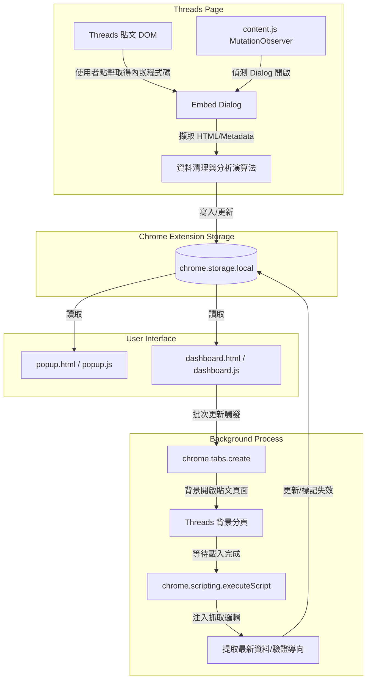

# Threads 程式碼儲存器

Threads 程式碼儲存器是一個基於 Manifest V3 標準設計的瀏覽器擴充功能，專門用於從 Threads 貼文中自動擷取、儲存、管理與匯出可嵌入的程式碼與貼文資料。

本專案完全運行於瀏覽器前端，所有資料皆安全地儲存在本機的 `chrome.storage.local` 中，無需依賴任何後端服務、外部資料庫或額外的 API 金鑰。

## 主要功能特性

- **自動攔截與儲存**：監控 Threads 貼文的「取得內嵌程式碼」對話框流程，在使用者複製內嵌程式碼的同時，自動完成資料擷取與儲存。
- **後設資料清理過濾**：智慧識別並過濾作者簡介、粉絲數、串文數（如「X 位粉絲 • Y 則串文」）以及平台的引導用語，避免無效或垃圾資訊污染貼文內文。
- **多維度欄位提取**：自動分析貼文並提取貼文內文、作者帳號與個人檔案連結、精確發文時間、自動產生的標籤群組、內含之程式碼區塊以及原始嵌入 Blockquote HTML 程式碼。
- **本機去重更新**：以貼文唯一連結 (`postLink`) 為主鍵，若重複儲存同篇貼文，系統會自動以最新狀態覆蓋更新，而非重複新增。
- **Popup 與 Dashboard 雙介面**：
  - **工具列彈出面板 (`popup.html`)**：提供快速檢視、快速搜尋、匯入匯出與前往儀表板的便捷入口。
  - **全頁儀表板 (`dashboard.html`)**：提供完整的貼文管理、全文檢索、多重排序、標籤篩選、統計圖表、批次操作與維護工具。
- **背景併發更新機制**：採用併發上限為 3 的非同步任務隊列，在背景開啟隱藏分頁對 Threads 貼文進行重新讀取，自動修正發文時間、更新內文、同步標籤，並偵測貼文是否失效。
- **失效狀態智慧標記**：當背景更新發現貼文被刪除、帳號設為私密、網址重新導向或頁面僅剩 fallback 摘要時，會自動標記貼文為失效（如 `redirected`、`post-not-found`、`fallback-summary`），便於維護資料庫健康度。
- **彈性匯出與匯入**：
  - 提供三種 JavaScript 陣列格式（`const posts = [...]`）的匯出選項：簡易嵌入碼匯出、精選貼文資料匯出、以及完整版資料匯出。
  - 支援匯入 JSON 或任何由擴充功能產生的 JS 陣列檔案，並可自由選擇合併（去重）或覆寫現有本機資料庫。

## 技術棧

- **核心語言**：JavaScript (ES6+)、HTML5、CSS3
- **擴充功能規範**：Chrome Extension Manifest V3
- **核心瀏覽器 API**：
  - `chrome.storage.local`：本機結構化資料持久化儲存。
  - `chrome.tabs`：背景開啟與管理分頁，進行非同步資料更新。
  - `chrome.scripting`：向動態分頁注入擷取指令。
- **第三方依賴**：無。本專案為原生 Vanilla JS 實作，無任何打包與編譯依賴。

## 開發前置條件

- 支持 Manifest V3 規範的 Chromium 核心瀏覽器（如 Google Chrome、Microsoft Edge、Brave、Opera 等）。
- 本專案在開發與執行時不需安裝任何編譯套件。若您有開發輔助指令或本機測試指令的需求，推薦使用 Bun 作為套件與命令管理器（例如以 `bun run` 取代 `npm run`）。

## 開發與安裝指引

### 1. 取得專案原始碼

```bash
git clone https://github.com/Scorpio-meow/threads-embedded-code.git
cd threads-embedded-code
```

### 2. 在瀏覽器中載入擴充功能

1. 開啟您的 Chromium 核心瀏覽器，導覽至擴充功能管理頁面（如 `chrome://extensions/` 或 `edge://extensions/`）。
2. 在頁面右上角開啟 **開發人員模式** 開關。
3. 點擊左上角的 **載入未封裝項目** 按鈕。
4. 選擇本專案的根目錄資料夾（即包含 `manifest.json` 的資料夾）。
5. 載入成功後，建議在瀏覽器工具列中將「Threads 程式碼儲存器」釘選，以利快速操作。

### 3. 開發偵錯與重新載入

- 當您修改了 `content.js`、`popup.js` 或 `dashboard.js` 等任何檔案後，請回到瀏覽器的擴充功能管理頁面，點擊該擴充功能卡片右下角的 **重新載入** 按鈕。
- 重新載入後，請重新整理已開啟的 Threads 網頁分頁，以確保最新的腳本成功注入並執行。

## 專案目錄結構

```text
threads-embedded-code/
├── manifest.json      # 擴充功能設定檔，定義權限、腳本注入規則與入口
├── content.js         # 注入至 Threads 網頁的 Content Script，負責 DOM 監聽與初次擷取
├── styles.css         # 注入至 Threads 網頁的樣式檔，用於顯示提示通知
├── popup.html         # 瀏覽器工具列彈出視窗的 UI 結構
├── popup.css          # 彈出視窗的樣式表
├── popup.js           # 彈出視窗的控制邏輯，處理快速檢索與資料備份
├── dashboard.html     # 全頁儀表板的 UI 結構
├── dashboard.css      # 儀表板的樣式表
├── dashboard.js       # 儀表板的控制邏輯，處理資料分析、批次維護與背景同步
├── favicon.png        # 擴充功能圖示
└── README.md          # 專案技術說明文件
```

## 系統架構與工作流程



### content.js 攔截流程

1. 當 Threads 頁面載入時，`content.js` 會建立一個 `MutationObserver` 持續監聽 `document.body`。
2. 當偵測到使用者點擊含有「取得內嵌程式碼」或「Embed Code」等特徵的按鈕時，擴充功能會延遲 1000 毫秒等待對話框完全渲染。
3. 自動定位 `role="dialog"` 元素，從其內部的唯讀輸入欄位（`input[readonly]` 或 `textarea[readonly]`）中擷取完整的內嵌 HTML 區塊（Blockquote 與 script 標籤）。
4. 同時自貼文容器 DOM 中往上或向下檢索貼文內文、發文者帳號、頭像、精確時間（`time[datetime]`），並將其彙整寫入本機儲存空間。

## 資料儲存 Schema

本擴充功能將所有貼文儲存在本機儲存空間的 `savedArticles` 鍵值中。其資料結構為一個物件陣列，單筆文章的 Schema 定義如下：

```typescript
interface SavedArticle {
  // 唯一識別碼，格式為 embed_[時間戳記]_[隨機字串]
  id: string;

  // 貼文的唯一 URL 連結，作為去重與更新的主鍵
  postLink: string;

  // 從 Threads 官方複製的完整內嵌 HTML 程式碼
  embedCode: string;

  // 貼文的原始發布時間 (ISO 8601 格式)
  timestamp: string;

  // 發布時間的標題顯示（如「2026年5月29日 上午10:00」，從 DOM 元素之 title 屬性取得）
  timestampTitle: string;

  // 此文章儲存至本機資料庫的時間 (ISO 8601 格式)
  savedAt: string;

  // 貼文的純文字內容（已剔除後設資料與無效字串）
  content: string;

  // 發文者的帳號（如 @username）
  author: string;

  // 發文者個人主頁的 URL
  authorUrl: string;

  // 自動擷取與推導出的標籤陣列，用於分類與過濾
  tags: string[];

  // 解析出的程式碼區塊陣列
  codeBlocks: CodeBlock[];

  // 程式碼區塊的總數量
  codeCount: number;

  // 貼文目前的存活狀態。active: 正常; expired: 失效
  status: 'active' | 'expired';

  // 貼文最後一次被背景更新的時間
  lastUpdated?: string;

  // 若貼文失效，記錄其失效的 ISO 時間
  expiredAt?: string;

  // 失效原因。redirected: 被重新導向; post-not-found: 找不到貼文; fallback-summary: 僅剩引導頁
  expiredReason?: 'redirected' | 'post-not-found' | 'fallback-summary';

  // 最後一次檢測失效時間
  expiredCheckedAt?: string;

  // 最後一次更新時間戳記的系統時間
  timestampUpdatedAt?: string;
}

interface CodeBlock {
  // 程式碼來源類型。markdown_block: 圍欄語法; html_tag: pre/code標籤; monospace: monospace樣式; inline: 行內代碼
  type: 'markdown_block' | 'html_tag' | 'monospace' | 'inline';

  // 程式碼純文字內容
  code: string;

  // 推測的程式語言名稱（如 javascript, python 等），若無法識別則為 unknown
  language: string;

  // 程式碼在該貼文中的順序索引 (從 1 開始)
  index: number;

  // 若為行內代碼，記錄行內代碼的總數量
  count?: number;
}
```

## 核心技術邏輯與演算法

### 1. 貼文內容擷取與後設資料過濾

在 Threads 平台上，網頁 DOM 經常包含許多干擾元素。為了精確取得貼文內文，擴充功能實作了以下過濾機制：
- **目標選擇器**：優先抓取 `span[class*="xo1l8bm"][dir="auto"] > span` 與 `span[class*="xi7mnp6"][dir="auto"] > span`，以涵蓋 Threads 的正文內容。
- **後設資料過濾器 (`isLikelyThreadsFallbackDescription`)**：利用正規表達式陣列排除非貼文正文之文字：
  - 瀏覽次數統計：如 `\d[\d,.]*\s*(?:萬|千)?次?瀏覽`
  - 粉絲與串文統計：如 `\d[\d,.]*\s*位粉絲\s*•\s*\d[\d,.]*\s*則串文`
  - 平台引導與回覆提示語：如「查看 @... 參與的最新對話」、「尚無回覆」、「為你推薦」、「個人檔案」、「分享」、「讚」等。
- **Fallback 擷取**：若 DOM 中無法提取內容，會嘗試從 `meta[property="og:description"]` 擷取，但同樣會過濾掉「加入 Threads 即可分享意見」等預設平台引導字樣。

### 2. 程式碼區塊識別演算法

擴充功能會透過四種管道識別貼文中的程式碼：
- **Markdown 圍欄語法**：使用正規表達式 `/```(\w*)\n([\s\S]*?)```/g` 擷取，並自動提取語言標籤。
- **DOM 程式碼標籤**：透過 `querySelectorAll('pre, code')` 檢索貼文內部的實體標籤。
- ** monospace 樣式**：檢索帶有 `style*="monospace"` 屬性的 DOM 元素。
- **行內程式碼**：透過正規表達式 `/`([^`\n]{2,})`/g` 提取行內程式碼，並將其合併為一個類型為 `inline` 的區塊。
- **語言自動偵測 (`detectLanguage`)**：利用特徵關鍵字檢測程式碼所屬語言（支援 javascript、python、java、cpp、csharp、html、css、sql、bash、json）。

### 3. 標籤推導與 Unicode 標準化

標籤的來源包含以下三種途徑：
- **官方標籤元素**：尋找 `a[href*="serp_type=tags"]` 或 `a[href*="tag_id="]` 等連結，解析其 URL 查詢參數中的標籤字串。
- **Hashtag 偵測**：使用正規表達式 `/#([a-zA-Z0-9_\u4e00-\u9fa5]+)/g` 解析內文中的雜湊標籤。
- **技術關鍵字匹配**：掃描貼文內文是否包含常用技術詞彙（如 JavaScript, TypeScript, React 等）。
- **NFC 標準化去重**：為避免因 Unicode 組合字元導致相同標籤被視為相異項目，所有提取出的標籤皆會通過 `.normalize('NFC')` 處理，並進行 Set 去重。

### 4. 背景分頁併發更新機制

為了克服瀏覽器 CORS 限制並獲取精確的 Threads 發文時間與內文，專案設計了本機背景分頁更新邏輯：
- **併發控制**：最大併發數限制為 3（`maxConcurrency = 3`），避免短時間內開啟過多分頁導致瀏覽器效能卡頓或觸發 Threads 防爬蟲限制。
- **生命週期管理**：
  1. 調用 `chrome.tabs.create({ url, active: false })` 靜默開啟分頁。
  2. 監聽 `chrome.tabs.onUpdated`，當分頁狀態變為 `complete` 時繼續執行。若超過 8000 毫秒未完成則自動超時放行。
  3. 比對跳轉後的 URL。若載入後的 URL 與原始連結的貼文 ID 不符，判定該貼文已被重新導向（通常代表貼文已被刪除或下架），並將其標記為 `redirected` 失效狀態。
  4. 使用 `chrome.scripting.executeScript` 向該分頁注入擷取函數。如果找不到貼文元素，則標記為 `post-not-found`；若只剩下引導摘要，則標記為 `fallback-summary`。
  5. 擷取完成後，背景程序會自動調用 `chrome.tabs.remove` 關閉分頁，並將最新數據回寫至 `chrome.storage.local`。

## 匯入與匯出規範

擴充功能支援本機資料庫的備份與還原，並提供三種匯出選項，均以 `const posts = [...]` 的 JavaScript 陣列結構匯出，方便外部網頁與精選貼文專案直接引用：

### 1. 簡易版 JS 嵌入碼匯出 (Embed Only)
- **用途**：供外部網頁直接引用嵌入程式碼。
- **格式**：只保留可以直接在 HTML 中渲染的 `blockquote` 嵌入程式碼，並自動剔除重複的 `<script async src="https://www.threads.com/embed.js"></script>` 腳本標籤，且對字串中的單引號與斜線進行轉義。
- **檔案命名**：`threads-embed-codes-[YYYY-MM-DD].js`
- **結構範例**：
  ```javascript
  const posts = [
      '<blockquote class="text-post-media" ...> ... </blockquote>',
      '<blockquote class="text-post-media" ...> ... </blockquote>'
  ];
  ```

### 2. 精選貼文資料 JS 匯出 (Featured Data)
- **用途**：專為精選貼文展示網頁（例如 Threads-Featured-Posts）設計，過濾了不必要的元數據。
- **格式**：匯出特定欄位組成的物件陣列，其中的 `embedCode` 已剔除 `script` 標籤，且 `author` 已移除帳號首字的 `@` 符號以方便識別。
- **檔案命名**：`threads-featured-data-[YYYY-MM-DD].js`
- **結構範例**：
  ```javascript
  const posts = [
      {
          "embedCode": "<blockquote class=\"text-post-media\" ...> ... </blockquote>",
          "postLink": "https://www.threads.net/@username/post/postId",
          "author": "username",
          "content": "貼文純文字內容",
          "tags": ["Tag1", "Tag2"]
      }
  ];
  ```

### 3. 完整版資料 JS 匯出 (Full Data)
- **用途**：用於本機資料庫完整備份、還原或跨裝置同步。
- **格式**：匯出包含 `SavedArticle` Schema 中定義的所有欄位（包括發布時間、本機儲存時間、失效狀態及原因等），其中的 `embedCode` 已剔除 `script` 標籤，且 `author` 保留 `@` 符號。
- **檔案命名**：`threads-full-data-[YYYY-MM-DD].js`
- **結構範例**：
  ```javascript
  const posts = [
      {
          "embedCode": "<blockquote class=\"text-post-media\" ...> ... </blockquote>",
          "postLink": "https://www.threads.net/@username/post/postId",
          "author": "@username",
          "content": "貼文純文字內容",
          "timestamp": "2026-06-21T09:00:00.000Z",
          "timestampTitle": "2026年6月21日 上午9:00",
          "savedAt": "2026-06-21T09:12:00.000Z",
          "tags": ["Tag1", "Tag2"],
          "status": "active",
          "expiredAt": "",
          "expiredReason": "",
          "expiredCheckedAt": ""
      }
  ];
  ```

### 4. 智慧匯入與合併邏輯
匯入資料時，系統支援選取 `.json` 檔案或上述三種 JavaScript 檔案（自動偵測 `const posts` 變數並加以解析）：
- **合併模式 (Merge)**：比對 `postLink`，若該貼文已存在於本機資料庫則自動跳過，僅匯入新的貼文。
- **覆寫模式 (Overwrite)**：清空目前本機的 `savedArticles` 內容，並以匯入檔案中的資料完全取代。
- **自動修復**：若匯入的資料中 `embedCode` 缺少 `<script ...>` 標籤，系統在匯入本機資料庫時會自動在末尾補上，確保在擴充功能介面中仍能正常預覽與生成。

## 權限與隱私聲明

本擴充功能在 `manifest.json` 中要求了最低限度的必要權限，以維護使用者隱私：
- `storage`：僅用於讀寫本機瀏覽器沙盒內的 `chrome.storage.local` 資料庫。
- `tabs`：僅用於在背景開啟更新貼文所需的分頁。
- `scripting`：僅用於向背景開啟的本專案分頁注入內容提取腳本。
- `host_permissions`：限制僅能存取 `https://www.threads.com/*` 與 `https://threads.com/*`。

本擴充功能**不會**將您的任何貼文資料、程式碼內容、個人瀏覽瀏覽紀錄或帳號資訊上傳至任何第三方伺服器。所有運算與儲存皆在您的個人本機電腦中完成。

## 疑難排解與常見問題

### Q：點擊取得內嵌程式碼後，為什麼沒有彈出儲存成功的提示？
- 請確認您的瀏覽器是否已正確登入 Threads 帳號。
- 請確認目前瀏覽的網址是否為標準的 `threads.com` 或 `www.threads.com` 貼文頁面。
- 有時因為網頁動態載入延遲，您可以嘗試重新整理 Threads 頁面，或在擴充功能管理頁面中將此擴充功能重新載入。

### Q：為什麼許多貼文在點擊更新後被標記為「失效貼文」？
- 這代表該貼文在 Threads 平台上可能已經被原作者刪除、封鎖，或者該作者的帳號已被設定為不對外公開的私密帳號。
- 另外，若您的網路連線不穩定，導致背景分頁載入超時（超過 8 秒），系統亦可能因為無法獲取資料而將其暫時視為無法存取的狀態。

### Q：Threads 平台改版後，擴充功能無法正常擷取內文或程式碼？
- 本擴充功能高度依賴 Threads 目前網頁結構的 CSS 選擇器與 class 特徵。
- 若 Threads 官方進行了 DOM 結構微調或 class 名稱混淆，請檢視 `content.js` 與 `dashboard.js` 中的相關選擇器定義，並進行相應更新。

## 免責聲明

本擴充功能為第三方獨立開發之開源工具，與 Meta 或 Threads 官方無任何關聯、授權或隸屬關係。Threads 平台的網頁結構、API 與使用規範可能隨時變更，若因平台改版導致擷取功能暫時失效，需等待維護者更新選擇器規則。使用者須自行承擔使用本工具之相關風險。