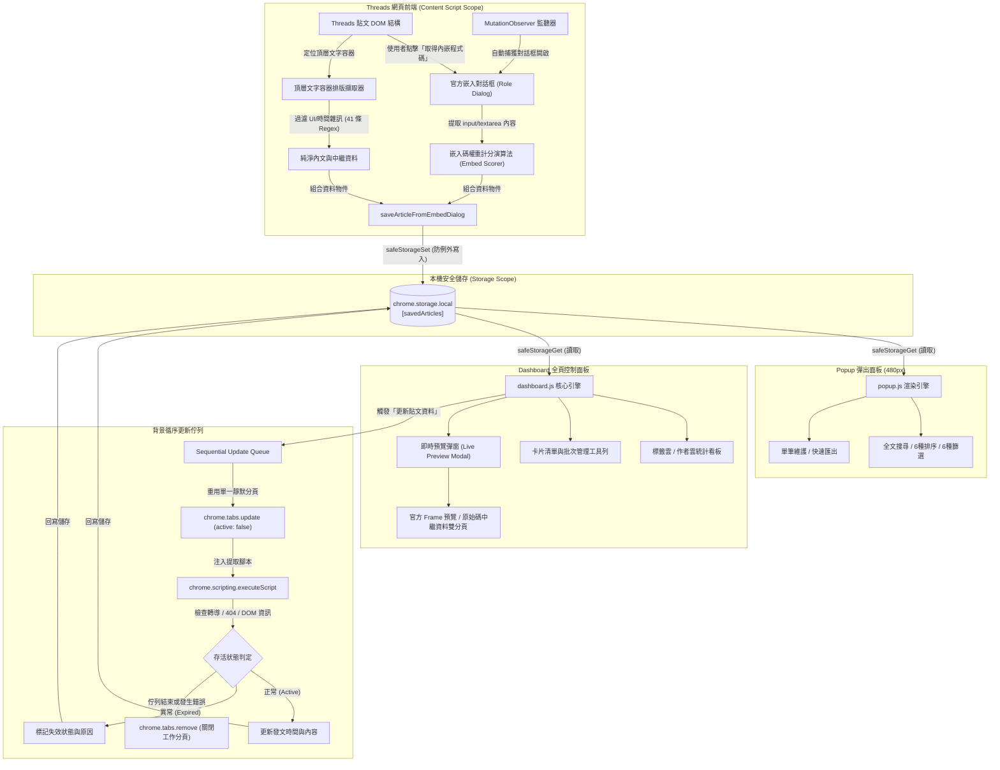
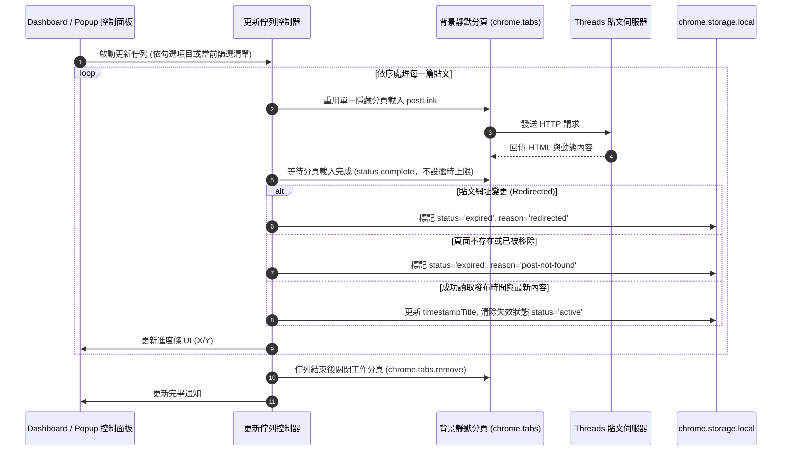
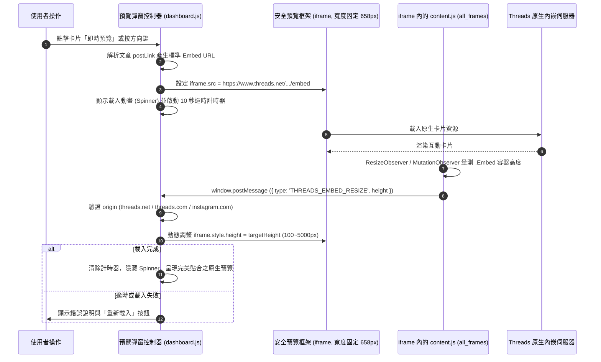

<div align="center">

# Threads 程式碼儲存器 (Threads Code Saver)

**自動擷取、清理、管理與匯出 Threads 貼文中的可嵌入程式碼與中繼資料**

**[前往介紹頁](https://scorpio-meow.github.io/Threads-embedded-code/)**：功能導覽、互動清洗示範與安裝教學

[](https://scorpio-meow.github.io/Threads-embedded-code/)
[](./manifest.json)
[](https://developer.chrome.com/docs/extensions/mv3/intro/)
[](./LICENSE)
[](#技術規格與技術棧)
[](#前置條件與環境需求)
[](#技術規格與技術棧)
[](https://github.com/Scorpio-meow/Threads-Featured-Posts)

---

基於 Google Chrome Manifest V3 標準設計的輕量級瀏覽器擴充功能。  
純前端架構、零外部依賴。所有資料均安全儲存於瀏覽器本機的 chrome.storage.local，  
無需任何後端伺服器、外部資料庫或第三方 API 金鑰，完整保障您的隱私與資料安全。

</div>

---

## 目錄

- [專案簡介與核心價值](#專案簡介與核心價值)
- [生態系與關聯專案](#生態系與關聯專案)
- [快速開始](#快速開始)
  - [前置條件與環境需求](#前置條件與環境需求)
  - [安裝與載入擴充功能](#安裝與載入擴充功能)
  - [基本操作流程](#基本操作流程)
- [核心功能特性](#核心功能特性)
  - [1. 智慧攔截與安全儲存](#1-智慧攔截與安全儲存)
  - [2. 頂層排版保留與深層文本清洗](#2-頂層排版保留與深層文本清洗)
  - [3. 多維度結構化欄位提取](#3-多維度結構化欄位提取)
  - [4. 控制面板即時預覽 (Live Preview)](#4-控制面板即時預覽-live-preview)
  - [5. 背景循序同步與失效監控佇列](#5-背景循序同步與失效監控佇列)
  - [6. 雙檢視介面與全方位批次操作](#6-雙檢視介面與全方位批次操作)
  - [7. 多維度分類篩選與彈性排序體系](#7-多維度分類篩選與彈性排序體系)
  - [8. 互動式標籤與作者統計雲](#8-互動式標籤與作者統計雲)
  - [9. 智慧容錯匯入與多格式匯出](#9-智慧容錯匯入與多格式匯出)
  - [10. 無障礙設計與可復原操作](#10-無障礙設計與可復原操作)
- [技術規格與技術棧](#技術規格與技術棧)
- [專案目錄與模組架構](#專案目錄與模組架構)
  - [專案檔案結構](#專案檔案結構)
  - [檔案職責對照表](#檔案職責對照表)
- [系統架構與流程圖](#系統架構與流程圖)
  - [整體系統架構圖](#整體系統架構圖)
  - [背景同步與失效恢復流程圖](#背景同步與失效恢復流程圖)
  - [即時預覽安全通訊協定圖](#即時預覽安全通訊協定圖)
- [核心演算法與技術實作細節](#核心演算法與技術實作細節)
  - [1. 頂層文字容器排版擷取演算法](#1-頂層文字容器排版擷取演算法)
  - [2. 嵌入碼對話框權重評分演算法](#2-嵌入碼對話框權重評分演算法)
  - [3. 標籤擷取與技術關鍵字映射](#3-標籤擷取與技術關鍵字映射)
  - [4. 41 條 UI 雜訊與時間過濾鏈](#4-41-條-ui-雜訊與時間過濾鏈)
  - [5. 非同步循序更新佇列與工作分頁架構](#5-非同步循序更新佇列與工作分頁架構)
  - [6. 即時預覽動態高度自適應通訊](#6-即時預覽動態高度自適應通訊)
- [資料模型與儲存 Schema](#資料模型與儲存-schema)
  - [SavedArticle 介面定義](#savedarticle-介面定義)
  - [儲存空間管理](#儲存空間管理)
- [配置與權限宣告](#配置與權限宣告)
  - [權限清單與使用目的](#權限清單與使用目的)
  - [內容安全政策 (CSP) 規範](#內容安全政策-csp-規範)
- [備份、匯出與匯入規範](#備份匯出與匯入規範)
  - [匯出格式對比與規範](#匯出格式對比與規範)
  - [匯出檔案範例](#匯出檔案範例)
  - [智慧匯入解析機制](#智慧匯入解析機制)
- [操作指南與快捷鍵速查](#操作指南與快捷鍵速查)
  - [控制面板即時預覽快捷鍵](#控制面板即時預覽快捷鍵)
  - [儀表板常用操作對照表](#儀表板常用操作對照表)
- [常見問題與疑難排解 (FAQ)](#常見問題與疑難排解-faq)
- [開發與貢獻指南](#開發與貢獻指南)
  - [開發與修改流程](#開發與修改流程)
  - [開發注意事項與架構規範](#開發注意事項與架構規範)
- [版本更新紀錄 (Changelog)](#版本更新紀錄-changelog)
- [AI 友善文件說明 (llms.txt)](#ai-友善文件說明-llmstxt)
- [授權條款與免責聲明](#授權條款與免責聲明)

---

## 專案簡介與核心價值

Threads 平台上有大量優質的程式設計分享與技術短文，然而官方原生介面未提供程式碼片段的收藏管理、格式化匯出與本地檢索工具。

「**Threads 程式碼儲存器**」為解決此痛點而生，具備以下核心價值：

| 核心價值 | 說明 |
| :--- | :--- |
| **無感自動擷取** | 只要在貼文點擊「取得內嵌程式碼」，擴充功能即自動在背景完成中繼資料與程式碼提取。 |
| **原始排版保真** | 採用頂層文字容器分析演算法，完整保留段落換行與程式碼縮排，徹底告別換行被壓平的困擾。 |
| **多層雜訊過濾** | 內建 41 條過濾正規表達式，自動剝離作者簡介、相對發文時間、輪播計數及平台導覽文字。 |
| **本機隱私安全** | 資料 100% 留存於瀏覽器本機儲存區，不會上傳到任何伺服器；對外連線僅限 Threads 官方網域（即時預覽與背景更新）及介面字型所用的 Google Fonts，無追蹤、無遙測。 |
| **靈活跨端複用** | 提供標準 HTML 內嵌碼、JSON 結構化資料、精選 JavaScript 配置檔等三種匯出格式，無縫串接個人網站或筆記庫。 |

---

## 生態系與關聯專案

本專案作為「**資料擷取與本機管理中樞**」，與前端展示專案 **[Threads-Featured-Posts](https://github.com/Scorpio-meow/Threads-Featured-Posts)** 構成完整的 Threads 內容收藏與公開展示生態系：

| 專案名稱 | 專案定位與職責 | 專案連結 |
| :--- | :--- | :--- |
| **Threads 程式碼儲存器** (本專案) | 瀏覽器擴充功能：負責 Threads 貼文智慧擷取、DOM 雜訊清洗、本機儲存、即時預覽與多格式匯出 | [GitHub 專案庫](https://github.com/Scorpio-meow/threads-embedded-code) |
| **Threads 精選貼文展示** (關聯專案) | 前端展示網站：接收本擴充功能匯出的「精選貼文資料 (threads-featured-data-*.js)」，提供響應式卡片流與展示介面 | [GitHub 專案庫](https://github.com/Scorpio-meow/Threads-Featured-Posts) |

### 雙專案協同運作流程

```
[在 Threads 瀏覽貼文] ──> [Threads 程式碼儲存器 (擴充功能)]
                                    │
                                    ▼ (點擊「匯出精選資料」)
                    [產出 threads-featured-data-*.js]
                                    │
                                    ▼ (作為資料來源引用)
                      [Threads-Featured-Posts 前端展示網站]
```

1. 在日常瀏覽 Threads 時，使用 **Threads 程式碼儲存器** 一鍵收藏優質程式碼與技術筆記。
2. 於控制面板中點擊「**匯出精選資料**」，擴充功能會自動去除作者帳號 `@` 前綴並格式化為前端配置物件。
3. 將匯出的檔案直接提供給 **[Threads-Featured-Posts](https://github.com/Scorpio-meow/Threads-Featured-Posts)** 專案作為資料來源，即刻完成個人技術精選貼文網站的更新與展示。

---

## 快速開始

### 前置條件與環境需求

- 支援 Manifest V3 的 Chromium 核心瀏覽器：
  - Google Chrome (版本 88 以上)
  - Microsoft Edge (版本 88 以上)
  - Brave Browser
  - Opera / Opera GX
  - Arc Browser
- 純前端原生專案，不需安裝任何額外編譯環境、執行環境或打包工具。

### 安裝與載入擴充功能

1. 取得專案原始碼：
   ```bash
   git clone https://github.com/Scorpio-meow/threads-embedded-code.git
   cd threads-embedded-code
   ```
2. 開啟瀏覽器並進入擴充功能管理頁面：
   - Google Chrome 請於網址列輸入：`chrome://extensions/`
   - Microsoft Edge 請於網址列輸入：`edge://extensions/`
3. 開啟頁面右上角的「**開發人員模式** (Developer mode)」。
4. 點擊左上角的「**載入未封裝項目** (Load unpacked)」。
5. 選取本專案的根目錄（即包含 [manifest.json](./manifest.json) 的資料夾）。
6. 在瀏覽器工具列的擴充功能圖示清單中，將「Threads 程式碼儲存器」釘選至工具列。

### 基本操作流程

```
[瀏覽 Threads 貼文] ──> [點擊「...」選單] ──> [選擇「取得內嵌程式碼」]
                                                    │
                                                    ▼
[資料自動提取並儲存] <── [綠色成功提示浮現] <── [自動攔截嵌入對話框]
        │
        ├──> [點擊工具列圖示] ────> 開啟 Popup 彈出面板 (快速檢索 / 排序 / 篩選 / 匯出)
        │
        └──> [點擊「控制面板」] ──> 開啟全螢幕 Dashboard (即時預覽 / 批次管理 / 標籤雲)
```

---

## 核心功能特性

### 1. 智慧攔截與安全儲存
- **DOM 變更監聽**：透過 `MutationObserver` 監控頁面 DOM 結構，搭配 5 秒週期性檢查，無縫捕捉使用者點擊「取得內嵌程式碼」所開啟的對話框。
- **主動式偵測機制**：透過 `processOpenEmbedDialogs` 函式，即使對話框由非擴充功能按鈕開啟，也能自動解析對話框中的唯讀輸入框並儲存。
- **上下文保護封裝**：內建 `safeStorageGet` 與 `safeStorageSet`，自動檢查擴充功能執行環境生命週期 (`isExtensionAlive`)，避免擴充功能更新或重載時拋出未捕獲的 `Extension context invalidated` 例外。

### 2. 頂層排版保留與深層文本清洗
- **原生排版與換行保留**：使用頂層文字容器 `innerText` 擷取策略，完整保留文章的自然段落換行（`\n`）與 `<br>` 標籤，解決傳統遍歷子節點時將多行內文壓縮為單行空格的問題，並確保同行的 `@提及` 與 `#標籤` 保持排版連貫。
- **UI 與時間雜訊深度過濾**：自動識別並清除作者簡介、追蹤者人數、串文數量、相對時間（如「2天」、「1小時」、「剛剛」）以及各類平台引導文字。目前共 41 條規則，涵蓋繁體中文與英文介面。
- **嚴格排除標頭連結**：精確過濾 `time` 標籤、`a[href*="/post/"]`、`a[href*="/t/"]` 貼文永久連結與 `a[href*="/@"]` 作者主頁連結，防止中繼標籤誤混入文章主體。
- **回覆邊界隔離**：在動態牆或個人首頁擷取時，偵測到「回覆...」邊界元素時自動切斷，確保僅擷取發文者所發布的主內容。
- **純圖片說明過濾**：透過 `isLikelyImageOnlyDescription` 智慧判別僅含圖片說明的貼文（如 `Photo by ... on ...`），避免無效擷取。

### 3. 多維度結構化欄位提取
系統會將每篇貼文完整解析為標準化的結構化資料物件：

| 欄位名稱 | 類型 | 說明 |
| :--- | :--- | :--- |
| **貼文內文** | `string` | 經過去除 UI 雜訊與中繼標籤後的純文字（保留完整段落換行） |
| **發文作者** | `string` | 發文者帳號（格式為 `@username`） |
| **作者主頁** | `string` | 發文者的 Threads 個人主頁完整網址 |
| **發文時間** | `string` | 包含標準 ISO 8601 時間字串與格式化標題文字 |
| **標籤清單** | `string[]` | 結合官方 Hashtag 與內文技術關鍵字自動映射的標籤陣列 |
| **內嵌代碼** | `string` | Threads 官方原生的標準 `<blockquote>` 嵌入代碼 |
| **貼文狀態** | `'active' \| 'expired'` | 標記貼文為正常存取中或已失效 |

### 4. 控制面板即時預覽 (Live Preview)
- **雙分頁即時渲染**：
  - **原生內嵌預覽 (Official Embed)**：遵循 Chrome Manifest V3 與 Threads 官方嵌入規範，透過安全 Frame 直接載入官方即時卡片，呈現完整的互動按鈕與動態樣式。
  - **原始碼與中繼資料 (Embed Code & Metadata)**：直接檢視乾淨的 `<blockquote>` 代碼與貼文中繼屬性對照表格。
- **官方標準寬度與高度自適應**：預覽寬度固定為 Threads 官方標準的 658px；高度由注入至 iframe 的 Content Script 量測 `.Embed` 容器後回報，長短貼文皆精準貼合，不留多餘空白或捲軸。
- **實際載入狀態回饋**：區分「載入中」、「載入逾時（10 秒）」與「載入失敗」三種狀態，逾時或失敗時顯示錯誤說明與「重新載入」按鈕；若該貼文沒有可用連結，則直接提示改看「原始碼與中繼資料」分頁。
- **全方位快捷鍵與導覽**：支援鍵盤 `ESC` 關閉、左/右方向鍵無縫切換上一篇/下一篇貼文、一鍵複製內嵌碼及直接開啟原文。

### 5. 背景循序同步與失效監控佇列
- **循序非同步更新**：點擊「更新貼文資料」時，系統會依照當前篩選與排序後的結果建立佇列（若已勾選貼文，則僅更新勾選項目），並重複使用**同一個背景工作分頁**循序載入，有效避免多開分頁導致的系統卡頓或平台流量限制。
- **不設等待上限**：分頁載入與頁面解析均不設逾時上限，注入腳本以 80ms 週期輪詢直到取得發文時間或內文為止，避免網路較慢時將正常貼文誤判為失效。
- **進度與中斷控制**：即時顯示「更新中 (X/Y)」進度條與百分比動畫，並提供「**暫停 / 繼續**」與「**取消**」功能按鈕。
- **智慧失效標記與自動恢復**：
  - 若貼文被刪除、轉為私密或發生轉導（`redirected`），系統將自動標記為 `expired` 並記錄原因。
  - 若頁面確認為不存在或移除（出現 404 或未找到貼文容器 `[data-pressable-container]`），將記錄為 `post-not-found`。
  - 若下次更新時貼文恢復可存取狀態，系統會自動清除失效標籤並恢復為 `active`。

### 6. 雙檢視介面與全方位批次操作
- **Popup 快速面板**：提供即時搜尋、多維度排序、類型篩選、單篇刪除、複製內嵌代碼、資料匯出與匯入功能。
- **Dashboard 全頁儀表板**：全螢幕響應式佈局，具備多欄位卡片展示、統計數據看板、批次操作功能與完整預覽。
- **批次勾選管理**：支援全選目前頁面與半選（Indeterminate）狀態顯示；未勾選任何項目時，「更新貼文資料」、「批次複製 Embed 代碼」與「批次刪除」一律維持 `disabled`，滑鼠與鍵盤皆無法觸發。
- **頁內確認 Modal**：兩個介面的破壞性操作（清除全部、批次刪除、覆寫匯入）全面改用頁內 Modal 二次確認，完全不使用原生 `confirm()`、`alert()` 與 `prompt()`；這對 Popup 尤其關鍵——原生對話框會在 Popup 失焦時連同 Popup 一併關閉並回傳預設值。

### 7. 多維度分類篩選與彈性排序體系
系統在 Popup 與 Dashboard 均提供 6 種篩選維度與 6 種排序規則：

- **6 種分類篩選模式**：
  - `全部文章 (all)`: 顯示資料庫中所有貼文。
  - `依作者 (author)`: 二級下拉選單動態列出所有作者，精確篩選特定發文者。
  - `依標籤 (tag)`: 二級下拉選單動態列出所有標籤，精確篩選特定技術主題。
  - `無內文 (noContent)`: 快速找出 `content` 為空的貼文（例如純圖片或未成功擷取內文者），便於集中維護。
  - `無發文時間 (noTimestamp)`: 篩選出未成功擷取官方發布時間或時間戳記與儲存時間異常之項目。
  - `失效貼文 (expired)`: 篩選出被原作者刪除、私密化或轉導的失效貼文。
- **6 種排序規則**：
  - `儲存時間: 新到舊 (savedAt-desc)` / `儲存時間: 舊到新 (savedAt-asc)`
  - `發布時間: 新到舊 (timestamp-desc)` / `發布時間: 舊到新 (timestamp-asc)`
  - `作者名稱: A-Z (author-asc)` / `作者名稱: Z-A (author-desc)`

### 8. 互動式標籤與作者統計雲
- **即時頻次計算**：自動統計所有貼文中的 Top 15 常用標籤與 Top 15 熱門作者。
- **點擊即時篩選**：點擊標籤雲或作者雲中的任一徽章，即可快速切換儀表板清單的篩選條件；再次點擊即可取消篩選。

### 9. 智慧容錯匯入與多格式匯出
- **三種專業匯出格式**：簡易版 JS 嵌入碼、精選貼文資料、完整版備份檔案。三者皆會在有勾選項目時**僅匯出勾選的貼文**，未勾選時則匯出目前的篩選結果。
- **雙來源匯入**：Popup 可選擇「選擇檔案」讀取 `.js` / `.json` 備份，或以「貼上內容」直接貼上匯出檔文字；Dashboard 則透過檔案選擇器匯入。
- **雙模式智慧匯入**：
  - **合併資料 (Merge)**：自動比對貼文網址（`postLink`），略過重複項目，僅將新貼文附加至清單尾端。
  - **完全覆寫 (Overwrite)**：清空現有資料庫，以匯入檔案內容完全取代；此模式必須再通過一次「確認完全覆寫」對話框才會執行。
- **高容錯解析引擎**：依序採用 `JSON.parse`、`new Function` 動態語法樹求值與正規表達式抽取，完美相容標準 JSON、物件陣列與帶有 `const posts =` 宣告的 JS 檔案。

### 10. 無障礙設計與可復原操作
- **完整 Modal 無障礙語意**：所有對話框均具備 `role="dialog"`、`aria-modal="true"` 與標題／描述關聯；開啟時自動聚焦、`Tab` 焦點鎖定於對話框內、`ESC` 可關閉，關閉後焦點自動回到觸發按鈕。
- **可復原的刪除與清除**：單篇刪除、批次刪除與清除全部資料後，會顯示帶有「復原」按鈕的提示（預設 8 秒）；同一時間僅保留一則復原提示，避免舊快照回捲較新的變更。
- **即時語音回饋**：Popup、Dashboard 的 Toast 容器與注入 Threads 頁面的通知皆為 live region（一般訊息 `role="status"`、錯誤訊息 `role="alert"`）；錯誤訊息停留時間也延長（面板 Toast 5 秒、Threads 頁面通知 6 秒，一般訊息為 2.5 秒）。
- **可操作的標籤與作者徽章**：統計雲徽章由 `span` 改為 `button` 並標註 `aria-pressed`，可用鍵盤聚焦並切換篩選狀態。
- **視覺與動態友善**：文字對比度提升至 4.5:1，偏小的點擊目標放大至 24×24px 以上，字級下限拉高到 12px；三份樣式表皆支援 `prefers-reduced-motion: reduce`，在系統要求減少動態時停用轉場動畫。
- **輸入防抖**：兩個介面的搜尋框皆加入 180ms debounce，資料量大時輸入不再卡頓。

---

## 技術規格與技術棧

```
+-----------------------------------------------------------------------+
|                             技術架構標準                              |
+-----------------------------------------------------------------------+
|  規範標準    | Chrome Extensions Manifest V3                          |
|  核心語言    | 原生 JavaScript (ES6+), HTML5, CSS3 Variables          |
|  依賴套件    | 無 npm 套件 (介面字型由 Google Fonts 載入)             |
|  資料儲存    | 瀏覽器本機儲存 (chrome.storage.local, 配額上限 10MB)   |
|  安全規範    | 符合嚴格 CSP (Content Security Policy)，無行內事件與樣式 |
|  相容平台    | Google Chrome, Microsoft Edge, Brave, Opera, Arc 等    |
|  建置流程    | 零編譯步驟 (Zero-build step, 開箱即用)                |
+-----------------------------------------------------------------------+
```

---

## 專案目錄與模組架構

### 專案檔案結構

```
threads-embedded-code/
├── manifest.json         # 擴充功能設定檔 (Manifest V3 權限與腳本規則)
├── content.js            # Content Script (DOM 監聽、對話框攔截、文本清洗、資料提取)
├── styles.css            # 注入至 Threads 網頁的通知提示樣式
├── popup.html            # 瀏覽器工具列彈出視窗 HTML
├── popup.css             # 彈出視窗樣式表 (深色主題、響應式清單)
├── popup.js              # 彈出視窗控制邏輯 (搜尋、排序、篩選、頁內 Modal、匯出、匯入)
├── dashboard.html        # 完整管理儀表板 HTML (包含即時預覽彈窗、統計看板、批次工具列)
├── dashboard.css         # 儀表板樣式表 (Grid 排版、預覽彈窗、動畫轉場、動態降級)
├── dashboard.js          # 儀表板控制邏輯 (統計雲、預覽控制器、循序佇列、批次處理、復原機制)
├── favicon.png           # 擴充功能 128x128 圖示資源
├── llms.txt              # AI 友善架構與 RAG 快速索引規範文件
└── README.md             # 專案說明文件 (本檔案)
```

### 檔案職責對照表

| 檔案路徑 | 模組層級 | 主要職責與實作內容 |
| :--- | :--- | :--- |
| `manifest.json` | 設定層 | 聲明 Manifest V3 規格、儲存與分頁權限、主機比對規則與 CSP 配置。 |
| `content.js` | 注入腳本層 | 負責監聽 Threads DOM 變化、攔截內嵌對話框、頂層排版提取與正規表達式文本清洗。 |
| `styles.css` | 注入樣式層 | 定義顯示於 Threads 頁面之儲存成功/失敗浮動通知外觀、進場動畫與 `prefers-reduced-motion` 降級。 |
| `popup.html` / `popup.js` | 快速檢視層 | 提供 480px 寬度的工具列快速面板，支援即時關鍵字查詢、6 種分類、6 種排序、單篇維護、頁內確認／匯入 Modal 與基本匯出。 |
| `dashboard.html` / `dashboard.js` | 完整管理層 | 全螢幕資料庫中心，提供 Live Preview 即時預覽、批次管理、標籤/作者統計雲、背景更新佇列與可復原的刪除操作。 |
| `llms.txt` | 規範說明層 | 提供 AI 代理與 RAG 檢索系統快速索引之結構化摘要說明文件。 |
| `README.md` | 完整文檔層 | 專案主要說明文件，包含完整系統架構、演算法剖析、資料 Schema 與常見問題。 |

---

## 系統架構與流程圖

### 整體系統架構圖



### 背景同步與失效恢復流程圖



### 即時預覽安全通訊協定圖



---

## 核心演算法與技術實作細節

### 1. 頂層文字容器排版擷取演算法

為避免抓取到的內文換行被過度壓平，`content.js` 採用頂層文字容器鎖定策略：

1. **定位候選容器**：選取 `span[class*="xo1l8bm"][dir="auto"]`、`span[class*="xi7mnp6"][dir="auto"]` 與 `div[class*="x1iorvi4"][dir="auto"]` 等主內容區塊。
2. **嚴格過濾時間與標頭節點**：
   - 排除 `time` 標籤本身及其父容器（`closest('time') || querySelector('time')`）。
   - 排除貼文固定網址標籤（`a[href*="/post/"]`、`a[href*="/t/"]`）。
   - 排除純作者標頭連結（`a[href*="/@"]`）。
   - 排除 Meta AI 引導文案與輪播指示器。
3. **頂層去重 (Top-level Deduplication)**：僅保留未被其他候選容器包含的最頂層容器，防止子節點文字重複提取。
4. **原生排版輸出**：直接調用 `innerText.trim()`，保留 `<br>` 與天然段落換行，最後以 `\n\n` 自然拼接各獨立段落。

```javascript
// 頂層容器過濾虛擬碼
const topLevelContainers = candidateContainers.filter(container => {
  return !candidateContainers.some(other => other !== container && other.contains(container));
});
const fullText = topLevelContainers
  .map(el => el.innerText.trim())
  .filter(Boolean)
  .join('\n\n');
```

### 2. 嵌入碼對話框權重評分演算法

當 Threads 彈出嵌入對話框時，頁面可能存在多個唯讀欄位（如純連結或短網址）。`extractEmbedCodeFromDialog` 對所有輸入框進行權重評分：

```javascript
let score = value.length;
if (/data-text-post-permalink=/i.test(value)) score += 1000;
if (/<blockquote/i.test(value)) score += 500;
if (/threads\.com/i.test(value)) score += 100;
```
最後挑選分數最高的內容作為最佳的 `embedCode`，確保 100% 取得包含完整 `blockquote` 的標準內嵌碼。

### 3. 標籤擷取與技術關鍵字映射

`extractTags` 由三個來源合併標籤，最後統一正規化並去重：

1. **官方 Hashtag 連結**：掃描貼文容器中的 `a[href*="serp_type=tags"]` 與 `a[href*="tag_id="]`，優先取網址中的 `q` 查詢參數，取不到時才退回連結文字，並去除開頭的 `#`。
2. **內文 Hashtag**：以 `/#([a-zA-Z0-9_\u4e00-\u9fa5]+)/g` 掃出內文中的中英文標籤。
3. **技術關鍵字映射**：比對 JavaScript、Python、Java、C++、C#、HTML、CSS、SQL、TypeScript、React、Vue、Angular 共 12 組關鍵字（不分大小寫），命中即補上對應標籤。

最後以 `String.prototype.normalize('NFC')` 統一 Unicode 表示法後透過 `Set` 去重，避免同一個中文標籤因組合字元差異而重複計數。

> [!NOTE]
> 背景更新佇列注入的 `extractPostInfoFromPage` 內含同一套標籤邏輯，因此每次執行「更新貼文資料」也會一併刷新標籤清單。

### 4. 41 條 UI 雜訊與時間過濾鏈

擷取到的原始文字會先經過 `cleanExtractedPostContent` 逐行處理（正規化空白、剝除輪播計數與翻譯按鈕、壓縮多餘空行），再由 `isLikelyThreadsFallbackDescription` 以 41 條正規表達式逐行比對，命中即整行剔除：

```javascript
function isLikelyThreadsFallbackDescription(text) {
  const normalizedText = String(text).replace(/\s+/g, ' ').trim();
  return [
    /\d[\d,.]*\s*(?:萬|千)?次?瀏覽/i,
    /^回覆[\s\S]*[…\.]{1,3}$/i,
    /^尚無回覆$/i,
    /^查看動態$/i,
    /^更多$/i,
    /^返回$/i,
    /^直欄標題$/i,
    /^附加影音內容$/i,
    /^新增 GIF$/i,
    /^展開撰寫工具$/i,
    /^分享$/i,
    /^轉發$/i,
    /^讚$/i,
    /^為你推薦$/,
    /^新串文$/,
    /^搜尋$/,
    /^動態$/,
    /^個人檔案$/,
    /^聯邦宇宙$/,
    /^洞察報告$/,
    /^已儲存$/,
    /^追蹤中$/,
    /^追蹤$/,
    /^已追蹤$/,
    /^(?:查看|隱藏)?翻譯$/i,
    /^(?:See|Hide)?\s*translation$/i,
    /^查看原文$/i,
    /^附帶原始貼文的回覆內容$/,
    /\d[\d,.]*\s*位粉絲\s*•\s*\d[\d,.]*\s*則串文/i,
    /\d[\d,.]*\s*followers\s*•\s*\d[\d,.]*\s*threads/i,
    /查看\s*@.+\s*參與的最新對話/i,
    /See\s*what\s*@.+\s*is\s*saying\s*on\s*Threads/i,
    /在貼文中提及\s*@meta\.ai\s*，即可在這裡獲得解答/i,
    /^\d+\s*(?:秒|分|分鐘|小時|天|週|年|s|m|h|d|w|y)(?:前)?$/i,
    /^\d{1,2}\s*月\s*\d{1,2}\s*日$/i,
    /^\d{4}\s*年\s*\d{1,2}\s*月\s*\d{1,2}\s*日$/i,
    /^[A-Z][a-z]{2}\s+\d{1,2}(?:,\s*\d{4})?$/i,
    /^(?:剛剛|昨天|前天|yesterday|just now)$/i,
    /^\d+\s*[\/／]\s*\d+(?:\s*[•·]\s*[\u4e00-\u9fa5\w]+)?$/i,
    /^\d+\s*(?:of|之)\s*\d+$/i,
    /^(?:圖片|相片|photo|image)\s*\d+\s*[\/／,，共of\s]+\d+(?:\s*張)?$/i
  ].some(pattern => pattern.test(normalizedText));
}
```

### 5. 非同步循序更新佇列與工作分頁架構

在 `dashboard.js` 中，貼文更新採用**單一可重用工作分頁**的循序控制迴圈，並於每一輪開頭檢查「取消」與「暫停」訊號：

```javascript
for (const article of articlesNeedingUpdate) {
  if (cancelUpdateRequested) break;
  while (isUpdatePaused && !cancelUpdateRequested) {
    await new Promise(resolve => setTimeout(resolve, 150)); // 暫停中等待恢復
  }
  if (cancelUpdateRequested) break;

  const tabId = await getOrCreateWorkerTab();                      // 重用同一個背景分頁
  const postInfo = await fetchPostInfoWithReusableTab(tabId, article.postLink);
  if (postInfo && postInfo.status === 'expired') {
    markArticleAsExpired(article, postInfo.reason);                // redirected / post-not-found / fallback-summary
  } else if (postInfo) {
    clearArticleExpiredStatus(article);                            // 貼文復活則清除失效標記
    // 寫回 timestamp、timestampTitle、content 與 tags
  }
  await chrome.storage.local.set({ savedArticles: allArticles });  // 逐篇即時落地
}
```

- **逐篇即時寫回**：每處理完一篇即寫入 `chrome.storage.local` 並重繪統計與標籤雲，中途取消或關閉頁面都不會遺失已完成的部分。
- **分頁生命週期**：工作分頁僅在擷取失敗或整個佇列結束（`finally`）時關閉，其餘時間重複使用，避免反覆開關分頁的成本。
- **不設逾時**：`waitForTabNavigation` 只監聽 `status === 'complete'` 與分頁被關閉兩種結果；注入頁面的解析器則以 80ms 輪詢直到取得資料或判定失效。

### 6. 即時預覽動態高度自適應通訊

Threads 官方 `/embed` 頁面不會主動回報高度，因此本擴充功能透過 `manifest.json` 的 `all_frames: true` 將 `content.js` 一併注入預覽 iframe。當腳本偵測到自己位於 `/embed` 或非頂層框架時，改走 `handleEmbedFrameResize()` 分支：以 `ResizeObserver` 與 `MutationObserver` 觀測 `.Embed` 容器、監聽圖片與影片的 `load` / `loadeddata` / `error` 事件，並搭配 50ms ~ 4000ms 共 8 段延遲重測，將量得的高度回傳父視窗：

```javascript
window.parent.postMessage({ type: 'THREADS_EMBED_RESIZE', height: h }, '*');
```

儀表板端在驗證來源網域後套用高度，並相容 Threads 官方可能送出的 `MEASURE` 訊息格式：

```javascript
function isAllowedEmbedOrigin(origin) {
  if (!origin) return false;
  try {
    const url = new URL(origin);
    const hostname = url.hostname.toLowerCase();
    const allowedDomains = ['threads.net', 'threads.com', 'instagram.com'];
    return allowedDomains.some(domain => hostname === domain || hostname.endsWith('.' + domain));
  } catch (_) {
    return false;
  }
}

window.addEventListener('message', (event) => {
  if (!isAllowedEmbedOrigin(event.origin)) return;
  let data = event.data;
  if (typeof data === 'string') {
    try { data = JSON.parse(data); } catch (_) { }
  }
  if (!data || typeof data !== 'object') return;

  let targetHeight = 0;
  if (data.type === 'THREADS_EMBED_RESIZE' && data.height) {
    targetHeight = Number(data.height);            // 由 content.js 量測後回報
  } else if (data.type === 'MEASURE' && data.details?.height) {
    targetHeight = Number(data.details.height);    // 相容官方 MEASURE 格式
  }
  if (targetHeight > 100 && targetHeight < 5000) {
    document.getElementById('previewIframe').style.height = `${targetHeight}px`;
  }
});
```

---

## 資料模型與儲存 Schema

所有貼文資料均以 `SavedArticle` 物件陣列形式儲存於 `chrome.storage.local` 的 `savedArticles` 鍵中。

### SavedArticle 介面定義

```typescript
interface SavedArticle {
  /** 唯一主鍵識別碼 (新儲存為 embed_[時間戳]_[隨機字串]；匯入資料為 imported_[時間戳]_[隨機字串]，來源檔已有 id 則沿用) */
  id: string;

  /** 貼文原始 URL，作為去重與更新的主鍵 */
  postLink: string;

  /** Threads 官方原生 <blockquote> HTML 內嵌碼 */
  embedCode: string;

  /** 發布時間 (ISO 8601 標準格式) */
  timestamp: string;

  /** 格式化發布時間標題 (例如: "2026年5月29日 上午10:00") */
  timestampTitle: string;

  /** 儲存至本機資料庫的時間 (ISO 8601) */
  savedAt: string;

  /** 貼文純文字內容 (已保留段落換行並清除 UI 雜訊) */
  content: string;

  /** 發文者帳號 (包含 @ 前綴，如 "@username") */
  author: string;

  /** 發文者 Threads 個人首頁網址 */
  authorUrl: string;

  /** 分類標籤清單 (包含 Hashtag 與技術關鍵字) */
  tags: string[];

  /** 貼文存活狀態 */
  status: 'active' | 'expired';

  /** 標記為失效的時間 (ISO 8601) */
  expiredAt?: string;

  /** 失效具體原因 */
  expiredReason?: 'redirected' | 'post-not-found' | 'fallback-summary' | 'unknown';

  /** 最後一次檢查存活狀態的時間 (ISO 8601) */
  expiredCheckedAt?: string;

  /** 發布時間戳記最後更新時間 (ISO 8601) */
  timestampUpdatedAt?: string;

  /** 匯入來源標記 */
  importedFrom?: 'full-data-file' | 'js-embed-file';
}
```

> [!NOTE]
> 自 v2.1.0 起，`codeBlocks` 與 `codeCount` 欄位已移除。相關抽取邏輯在舊版儲存流程被嵌入對話框攔截取代後即未再接線，新資料一律為空陣列；匯入舊備份時也不會再保留這兩個欄位，程式碼內容亦不再納入搜尋範圍（搜尋比對 `content`、`author`、`tags` 與 `embedCode`）。

### 儲存空間管理

- **儲存配額**：Chromium `chrome.storage.local` 預設配額為 **10MB**（約可容納 3,000 至 5,000 篇包含完整中繼資料的貼文）。
- **配額預警**：若儲存時發生 `QUOTA_BYTES_EXCEEDED` 錯誤，系統會自動彈出提示。建議定期將資料匯出為「完整版資料備份檔案」並清理不必要的舊資料。

---

## 配置與權限宣告

### 權限清單與使用目的

本擴充功能嚴格遵循最小權限原則（Principle of Least Privilege），僅宣告達成功能所需之必要權限：

| 權限項目 | 權限類型 | 宣告用途與安全說明 |
| :--- | :--- | :--- |
| `storage` | API 權限 | 讀取與寫入本機 `chrome.storage.local` 資料庫。 |
| `tabs` | API 權限 | 在背景建立靜默分頁以執行「更新貼文資料」與失效檢查。 |
| `scripting` | API 權限 | 向背景載入的 Threads 分頁動態注入資訊擷取腳本。 |
| `https://www.threads.com/*` | 主機權限 | 允許在標準 Threads 網域注入 Content Script 並讀取貼文內容。 |
| `https://threads.com/*` | 主機權限 | 允許在非 www 前綴的 Threads 網域執行相同操作。 |
| `https://www.threads.net/*` | 主機權限 | 支援透過官方 threads.net 網域載入即時預覽 Frame 與發文時間同步。 |
| `https://threads.net/*` | 主機權限 | 支援非 www threads.net 網域主機權限。 |

### 內容安全政策 (CSP) 規範

```json
"content_security_policy": {
  "extension_pages": "script-src 'self'; object-src 'self'; frame-src https://www.threads.com https://www.threads.net https://*.threads.com https://*.threads.net;"
}
```
- **禁止外部腳本**：所有頁面僅載入本機自帶之腳本（`script-src 'self'`），不載入任何外部 CDN 腳本或遠端代碼；唯一的外部資源是 `popup.css`、`dashboard.css` 以 `@import` 引入的 Google Fonts 字型樣式表。
- **安全 Frame 來源**：僅限定允許嵌入來自 Threads 官方網域（`threads.com` 與 `threads.net`）之 iframe 預覽元件。

---

## 備份、匯出與匯入規範

### 匯出格式對比與規範

三種匯出皆以「目前的選取狀態」決定範圍：**有勾選貼文時僅匯出勾選項目**，未勾選時則匯出當前篩選與排序後的清單。

| 格式名稱 | 匯出檔案名稱規範 | 格式結構 | 適用情境與特點 |
| :--- | :--- | :--- | :--- |
| **簡易版嵌入碼 (Embed Only)** | `threads-embed-codes-YYYY-MM-DD.js` | `const posts = ['<blockquote>...</blockquote>', ...];` | 專為靜態網頁快速引用設計，已自動移除重複的 script 標籤並轉義引號。 |
| **精選貼文資料 (Featured Data)** | `threads-featured-data-YYYY-MM-DD.js` | `const posts = [{ embedCode, postLink, author, content, tags }, ...];` | 專為關聯專案 [Threads-Featured-Posts](https://github.com/Scorpio-meow/Threads-Featured-Posts) 設計，author 欄位自動去除 `@` 前綴以利作為 Key 或展示標籤使用。 |
| **完整版備份資料 (Full Data)** | `threads-full-data-YYYY-MM-DD.js` | `const posts = [{ embedCode, postLink, author, content, timestamp, timestampTitle, savedAt, tags, status, ... }, ...];` | 包含內文、時間、標籤與失效狀態等欄位，適用於跨裝置備份、資料遷移與災難還原。不含 `id` 與 `authorUrl`：匯入時會重新產生 `id`，`authorUrl` 則為空值。 |

### 匯出檔案範例

#### 1. 簡易版嵌入碼 (threads-embed-codes-YYYY-MM-DD.js)
```javascript
const posts = [
    '<blockquote class="text-post-media" data-text-post-permalink="https://www.threads.com/@user/post/abc123xyz">...</blockquote>',
    '<blockquote class="text-post-media" data-text-post-permalink="https://www.threads.com/@developer/post/def456uvw">...</blockquote>'
];
```

#### 2. 精選貼文資料 (threads-featured-data-YYYY-MM-DD.js)
```javascript
const posts = [
    {
        "embedCode": "<blockquote class=\"text-post-media\" data-text-post-permalink=\"https://www.threads.com/@user/post/abc123xyz\">...</blockquote>",
        "postLink": "https://www.threads.com/@user/post/abc123xyz",
        "author": "user",
        "content": "分享一段實用的 JavaScript 技巧：...",
        "tags": ["JavaScript", "Frontend"]
    }
];
```

#### 3. 完整版備份資料 (threads-full-data-YYYY-MM-DD.js)
```javascript
const posts = [
    {
        "embedCode": "<blockquote class=\"text-post-media\" ...>...</blockquote>",
        "postLink": "https://www.threads.com/@user/post/abc123xyz",
        "author": "@user",
        "content": "完整貼文內容...",
        "timestamp": "2026-05-29T02:00:00.000Z",
        "timestampTitle": "2026年5月29日 上午10:00",
        "savedAt": "2026-05-29T02:10:00.000Z",
        "tags": ["JavaScript", "WebDev"],
        "status": "active",
        "expiredAt": "",
        "expiredReason": "",
        "expiredCheckedAt": ""
    }
];
```

### 智慧匯入解析機制

匯入模組具備極高的容錯韌性，採三階段解析管線：

```
[選擇檔案 (.js / .json)]   或   [Popup 直接貼上匯出檔內容]
           │                              │
           └──────────────┬───────────────┘
                          ▼
              [階段一] JSON.parse 直接解析
                          │ (失敗)
                          ▼
   [階段二] new Function('return ' + arrayStr)() 語法樹動態求值
                          │ (失敗)
                          ▼
     [階段三] 正規表達式抽取器 (Token Pattern Extraction)
                          │
                          ▼
        [匯入模式選擇 Modal (合併資料 / 完全覆寫)]
                          │
                          ▼ (選擇「完全覆寫」時)
          [二次確認 Modal：確認完全覆寫 / 取消]
```

> [!NOTE]
> `.json` 檔會直接以 `JSON.parse` 解析（支援純陣列或 `{ "savedArticles": [...] }` 包裝）；`.js` 檔與 Popup 貼上的文字則走上述三階段管線。

> [!IMPORTANT]
> - **合併資料 (Merge)**：以 `postLink` 進行貼文去重。若該貼文已存在於本機儲存則略過，僅將新貼文附加至清單尾端，現有資料完全保留。
> - **完全覆寫 (Overwrite)**：清空現有的本機資料，完全以匯入檔案中的內容取代。此模式必須再通過一次「確認完全覆寫」對話框；直接關閉或按 `ESC` 一律視為取消，不會誤觸覆寫。

---

## 操作指南與快捷鍵速查

### 控制面板即時預覽快捷鍵

| 按鍵 | 操作動作 |
| :--- | :--- |
| `ESC` | 關閉即時預覽彈窗 (Close Modal) |
| `←` (左方向鍵) | 切換至上一篇貼文預覽 (Navigate Previous) |
| `→` (右方向鍵) | 切換至下一篇貼文預覽 (Navigate Next) |
| `點擊遮罩外側` | 關閉即時預覽彈窗 |

### 儀表板常用操作對照表

| 操作目標 | 操作方式 |
| :--- | :--- |
| **開啟即時預覽** | 點擊貼文卡片下方的「即時預覽」按鈕。 |
| **切換預覽分頁** | 在預覽視窗工具列點擊「原生內嵌預覽」或「原始碼與中繼資料」；預覽寬度固定為官方標準 658px，高度自動貼合貼文內容。 |
| **批次操作** | 勾選個別卡片左上角核取方塊，或點擊工具列「全選目前頁面」；未勾選時三個批次按鈕皆為停用狀態，勾選後即可使用「更新貼文資料」、「批次複製 Embed」與「批次刪除」。 |
| **依標籤/作者篩選** | 點擊側邊欄標籤雲或作者雲中的任一徽章，即可快速套用篩選；再次點擊即取消。 |
| **多維度分類與排序** | 透過頂部下拉選單切換 6 種分類篩選（如無內文、失效貼文）與 6 種排序規則。 |
| **背景同步更新** | 點擊側邊欄「更新貼文資料」可更新目前篩選結果；若已勾選貼文則改用批次工具列的「更新貼文資料」，僅更新勾選項目。執行中可隨時「暫停/繼續」或「取消」。 |
| **自選範圍匯出** | 先勾選欲匯出的貼文，再點擊任一匯出按鈕，即只匯出勾選項目；未勾選時匯出目前篩選結果。 |
| **復原誤刪** | 單篇刪除、批次刪除與清除全部後，畫面下方中央的提示會出現「復原」按鈕，預設 8 秒內點擊即可還原。 |
| **匯入資料** | Popup 點「匯入」後可選擇讀取檔案或直接貼上內容；Dashboard 點「匯入資料檔案」選擇備份檔，接著選擇合併或覆寫。 |

---

## 常見問題與疑難排解 (FAQ)

> [!WARNING]
> **問題：點擊取得內嵌程式碼後，網頁上沒有出現「儲存成功」提示？**
> - 請確認瀏覽器是否已登入 Threads 帳號。未登入狀態下，Threads 官方對話框可能無法正確產生內嵌代碼。
> - 確認當前頁面網址是否為標準的 `threads.com` 或 `www.threads.com` 網域。
> - 若瀏覽器開發者主控台出現 `Extension context invalidated` 警告，此為 Chrome 重新載入擴充功能後的常見安全機制，只需重新整理對應的 Threads 網頁即可恢復運作。

> [!NOTE]
> **問題：為什麼有些貼文在背景更新後被標記為「失效貼文」？**
> - 這代表貼文可能已被原作者刪除、帳號被設為私密，或原作者封鎖了匿名存取。
> - 背景分頁若確認頁面不存在（例如 404 或已刪除），也會判定為失效。
> - 若貼文隨後恢復正常，在下一次更新時，系統偵測到內容便會自動將其回復為 `active` 狀態。

> [!CAUTION]
> **問題：Threads 官方改版後，擴充功能無法正常擷取？**
> - 本工具高度依賴 Threads 前端網頁的 DOM 選擇器特徵（例如特定編碼的 class 類別）。
> - 若 Threads 官方進行了重大的結構或樣式修改，將會導致擷取演算法失效。此時請將問題提交至 GitHub Issue，我們將會盡快更新 `content.js` 中對應的 CSS 選擇器。

> [!IMPORTANT]
> **問題：本機儲存空間是否有限制？**
> - `chrome.storage.local` 在多數 Chromium 瀏覽器中預設有 **10MB** 的配額限制。
> - 當儲存空間接近上限並拋出 `QUOTA_BYTES_EXCEEDED` 錯誤時，擴充功能會提示您清理。建議定期將完整版資料匯出備份，並清除不需要的舊貼文。

> [!TIP]
> **問題：不小心刪錯貼文或按到「清除全部資料」怎麼辦？**
> - 刪除、批次刪除與清除全部皆為可復原操作，畫面下方中央的提示列會顯示「復原」按鈕，預設 8 秒內點擊即可完整還原。
> - 提示消失後即無法復原，因此執行清除前仍建議先「匯出完整資料」備份。
> - 匯入時若選擇「完全覆寫」，必須再通過一次確認對話框；關閉視窗或按 `ESC` 一律視為取消。

---

## 開發與貢獻指南

歡迎所有開發者協助改進本專案！如果您有任何建議或發現 Bug，請隨時提交 Issue 或 Pull Request。

### 開發與修改流程

本專案為純原生前端架構之瀏覽器擴充功能，零外部相依、無編譯打包步驟、亦無需啟動任何本機伺服器：

```bash
# 複製專案庫
git clone https://github.com/Scorpio-meow/threads-embedded-code.git
cd threads-embedded-code

# 直接在瀏覽器擴充功能頁面載入未封裝項目，即可開始偵錯與開發
```

### 開發注意事項與架構規範

- **零外部依賴原則**：專案嚴格保持原生輕量化設計，請勿引入任何 npm 執行期依賴或外部 CDN 框架。
- **嚴格 CSP 相容**：所有 HTML 頁面及注入的腳本**禁止使用行內樣式 (inline style) 與行內事件監聽器**（例如 `onclick="..."`），必須使用 `addEventListener` 進行事件綁定。
- **欄位擴展規範**：若在 `content.js` 中新增或修改了儲存欄位，請務必同步更新本 README 的 [資料模型與儲存 Schema](#資料模型與儲存-schema) 區段、[llms.txt](./llms.txt) 與匯出/匯入模組。
- **禁用原生對話框**：`confirm()`、`alert()` 與 `prompt()` 一律以頁內 Modal 取代。Popup 失焦時原生對話框會連同 Popup 一併關閉並回傳預設值，極易造成誤觸破壞性操作。
- **無障礙基本要求**：新增的 Modal 需具備 `role="dialog"`、`aria-modal="true"`、焦點鎖定與焦點還原；可點擊元素請使用 `button` 並維持 24×24px 以上的點擊區域；停用狀態請使用 `disabled` 而非僅靠 `pointer-events: none`。

---

## 版本更新紀錄 (Changelog)

本專案嚴格遵循 [Keep a Changelog](https://keepachangelog.com/zh-TW/1.0.0/) 格式規範。

### [2.1.0] - 2026-09-19

#### 新增
- 實作控制面板即時預覽彈窗 (Live Preview Modal)，支援原生內嵌與原始碼雙分頁檢視。
- 即時預覽新增實際的「載入中 / 逾時 (10 秒) / 載入失敗」狀態與「重新載入」重試按鈕。
- 支援鍵盤快捷鍵操作（`ESC` 關閉、左/右方向鍵切換上一篇/下一篇貼文）。
- 實作背景循序更新佇列之「暫停 / 繼續」與「取消」控制機制。
- 新增「無內文 (noContent)」分類篩選設定，方便集中檢視與管理無文字描述之貼文。
- 儀表板批次工具列新增「更新貼文資料」按鈕，可直接更新已勾選的貼文。
- 三種匯出格式（JS 嵌入碼 / 精選資料 / 完整資料）皆支援僅匯出已勾選的貼文。
- Popup 新增「選擇檔案 / 貼上內容」雙來源匯入對話框。
- 單篇刪除、批次刪除與清除全部改為可復原操作，提示列提供 8 秒「復原」按鈕。
- 所有 Modal 補上 `role="dialog"`、`aria-modal`、焦點鎖定、`ESC` 關閉與焦點還原；統計雲徽章改為 `button` 並標註 `aria-pressed`；Toast 與注入 Threads 頁面的通知改為 live region。
- 三份樣式表皆加入 `prefers-reduced-motion: reduce` 降級支援。

#### 改善
- 優化頂層文字容器 `innerText` 排版擷取演算法，解決過往使用 `\s+` 壓平換行導致多行排版遺失的問題，完整保留段落換行與 `<br>` 標籤。
- 強化發文時間與標頭連結過濾：嚴格排除 `time` 標籤與 `a[href*="/post/"]`、`a[href*="/t/"]` 貼文固定網址節點，徹底杜絕發文時間誤納入內文。
- 擴充 UI 與時間雜訊正規表達式至 41 條，涵蓋相對時間（如「2天」、「1小時」、「剛剛」）、輪播計數與繁體中文／英文介面文案。
- 背景更新改為重複使用單一工作分頁，並依目前的勾選或篩選結果決定更新順序與範圍。
- 移除分頁載入與頁面解析的等待上限，改以 80ms 輪詢直到取得資料或判定失效。
- 預覽寬度固定為官方標準 658px，高度改由注入 iframe 的 `content.js` 量測 `.Embed` 容器後回報。
- 搜尋輸入加入 180ms debounce；文字對比度補至 4.5:1，偏小的點擊目標放大至 24×24px 以上，字級下限拉高到 12px。
- 清理冗餘 CSS 樣式並補齊未定義的 CSS 變數。

#### 修正
- 修復批次更新時 Toast 訊息堆疊異常，並新增動態進度即時顯示。
- 修復匯入以原生 `confirm()` 呈現「合併／覆寫」雙選項，導致 `ESC` 與「取消」皆回傳 `false` 而誤觸全量覆寫的問題；改為頁內 Modal 且覆寫需二次確認。
- 修復儀表板批次操作僅以 `pointer-events` 停用、仍可由鍵盤觸發的問題，改用 `disabled` 屬性。
- 修復載入逾時的貼文被誤判為已失效與轉導的問題。
- 修復長貼文預覽被壓縮、短貼文留白，以及預覽容器 17px 捲軸佔位的問題。
- 補上 Popup 缺漏的 `importFileInput` 元素。
- 同一時間僅保留單一復原提示，避免舊快照回捲較新的變更。
- 修正 Popup 與 Dashboard 搜尋框的標籤與提示文字，改為實際比對的欄位（內文、作者、標籤、內嵌代碼），不再提及已移除的程式碼與語言搜尋。

#### 移除
- **[BREAKING]** 移除 `codeBlocks` 與 `codeCount` 欄位及其程式碼卡片 UI、程式碼搜尋、程式碼複製按鈕與匯入欄位。抽取邏輯在舊儲存流程廢棄後即未接線，新資料一律為空陣列；匯入舊備份不再保留該欄位，程式碼內容亦不再納入搜尋。
- 移除即時預覽的多裝置寬度切換（480px / 320px / 100%），預覽固定為官方標準 658px。
- 移除 Popup 與 Dashboard 排序選單中的「程式碼數量」選項與對應邏輯。
- 移除未被引用的 `refreshAllEmbedCodes`、`batchRegenEmbedCodes` 等函式與冗餘樣式。
- 移除 Popup 中已無 UI 入口的 `refreshEmbedCode` 與其專用的 `buildThreadsEmbedCode`（對應的「重新產生」按鈕早已從 HTML 移除），並將失去寫入者的 `lastUpdated` 欄位一併從資料結構中移除；匯出與匯入本來就未帶此欄位，僅舊版本機紀錄可能殘留無人讀取的舊值。

#### 安全性
- 強化控制面板 `window.postMessage` 通訊來源白名單驗證機制，嚴格限定為 `threads.net`、`threads.com` 與 `instagram.com` 官方網域。
- 修復即時預覽彈窗中繼資料解析渲染時的潛在 DOM XSS 漏洞，全數改用安全文字節點設定。

### [2.0.5] - 2026-07-06

#### 新增
- 實作 `safeStorageGet` 與 `safeStorageSet` 封裝，防止 context invalidated 後未捕獲的例外中斷腳本執行。
- 支援 `processOpenEmbedDialogs` 主動偵測機制，即使用戶未透過擴充功能按鈕開啟嵌入對話框也能成功擷取。

#### 改善
- 擴充過濾規則至 20 種以上的 UI 雜訊模式，並新增英文語系介面的過濾規則。
- 優化背景併發更新佇列的超時處理與重試邏輯。

#### 修正
- 修正 `isSameThreadsPostLink` 在特定自訂貼文 URL 格式下的誤判問題。
- 修正批次刪除完成後，全選核取方塊的半選 (indeterminate) 狀態未正確重置的異常。

### [2.0.0] - 2026-06-21

#### 新增
- 上線全網頁版儀表板 (Dashboard UI)。
- 支援三種匯出格式：簡易嵌入碼、精選貼文資料、完整版資料。
- 支援背景分頁自動更新與失效智慧標記。
- 新增 Top 15 標籤統計雲與作者統計雲。
- 實作自訂確認 Modal，全面替換原生 `confirm()`。

#### 改善
- 嵌入碼對話框掃描改用分數權重演算法，大幅降低誤選率。
- 全面移除行內樣式，相容瀏覽器嚴格 CSP。

### [1.0.0] - 2026-05-15

#### 新增
- 首次發布 Threads 程式碼儲存器擴充功能。
- 支援基本 DOM 監聽與點擊自動儲存至 `chrome.storage.local`。
- 支援 Popup 檢視面板與基本的單篇刪除功能。

---

## AI 友善文件說明 (llms.txt)

本專案已在根目錄提供獨立的 **[llms.txt](./llms.txt)** 規格文件，專供 AI 代理、LLM 檢索工具與 RAG 索引系統快速讀取與結構化解析本專案：

- 獨立文件路徑：`llms.txt`
- 包含內容：專案核心資訊、核心模組路徑、完整資料模型 Schema、核心演算法實作機制與關聯專案資訊。

---

## 授權條款與免責聲明

### 授權條款

本專案採用 **[MIT 授權條款](./LICENSE)** 開源釋出。您可以自由使用、修改、分發與整合於個人或商業專案中。

### 免責聲明

本擴充功能為第三方獨立開發之開源工具，與 Meta 或 Threads 官方無任何關聯、授權或隸屬關係。Threads 平台的網頁結構、API 與使用規範可能隨時變更，若因官方平台改版導致擷取功能暫時失效，需等待維護者更新選擇器規則。使用者須自行承擔使用本工具之相關風險。

---

<div align="center">

**Threads 程式碼儲存器 (Threads Code Saver)**  
由 [Scorpio-meow](https://github.com/Scorpio-meow) 開發與維護

</div>