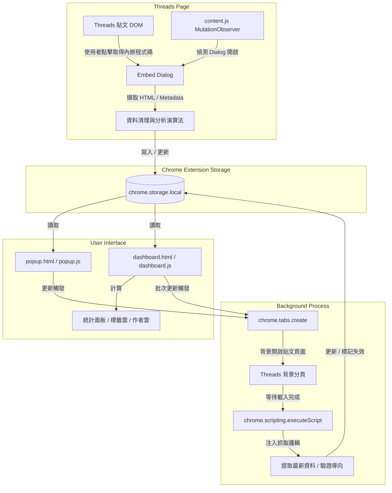

<div align="center">

# Threads 程式碼儲存器

**從 Threads 貼文中自動擷取、儲存、管理與匯出可嵌入的程式碼與貼文資料**

[](./manifest.json)
[](https://developer.chrome.com/docs/extensions/mv3/intro/)
[](./LICENSE)
[](#技術棧)
[](#開發前置條件)

---

基於 Manifest V3 標準設計的瀏覽器擴充功能。  
純前端、零依賴 — 所有資料安全儲存於本機 `chrome.storage.local`，  
無需後端服務、外部資料庫或 API 金鑰。

</div>

---

## 目錄

- [快速開始](#快速開始)
- [主要功能特性](#主要功能特性)
- [技術棧](#技術棧)
- [專案目錄結構](#專案目錄結構)
- [系統架構](#系統架構)
- [資料儲存 Schema](#資料儲存-schema)
- [核心技術邏輯與演算法](#核心技術邏輯與演算法)
- [使用者介面](#使用者介面)
- [匯入與匯出規範](#匯入與匯出規範)
- [權限與隱私聲明](#權限與隱私聲明)
- [疑難排解](#疑難排解)
- [貢獻指南](#貢獻指南)
- [Changelog](#changelog)
- [免責聲明](#免責聲明)

---

## 主要功能特性

### 自動攔截與儲存

> 監控 Threads 貼文的「取得內嵌程式碼」對話框流程，在使用者複製內嵌程式碼的同時，自動完成資料擷取與儲存。

- 使用 `MutationObserver` 持續監聽 DOM 變更，搭配每 5 秒週期性定時掃描，確保可靠偵測嵌入按鈕
- 支援直接偵測已開啟的嵌入對話框（`processOpenEmbedDialogs`），即使未透過擴充功能監聽的按鈕開啟亦可自動儲存

### 安全的擴充功能存取層

- 使用 `safeStorageGet` / `safeStorageSet` 封裝函數存取 `chrome.storage.local`，自動偵測擴充功能是否仍然存活（`isExtensionAlive`）
- 當 Context Invalidated 時，優雅地忽略讀寫操作而非拋出未捕獲例外

### 後設資料智慧過濾

- 自動識別並過濾作者簡介、粉絲數、串文數（如「X 位粉絲 · Y 則串文」）及平台引導用語
- 覆蓋超過 **20 種** Threads 平台 UI 雜訊模式，支援繁體中文與英文介面
- 「僅含圖片」偵測（`isLikelyImageOnlyDescription`）：自動辨識 `Photo by ... on ...` 等純圖片貼文描述

### 多維度欄位提取

| 欄位 | 說明 |
|:-----|:-----|
| **貼文內文** | 已剔除後設資料與無效字串的純文字內容 |
| **作者帳號** | 發文者的 `@username` 與個人檔案連結 |
| **精確發文時間** | ISO 8601 格式 `datetime` + 人類可讀 `title` |
| **標籤群組** | 自動產生（含官方標籤、Hashtag、技術關鍵字匹配） |
| **程式碼區塊** | 內含之程式碼區塊及推測語言 |
| **嵌入程式碼** | 原始 Blockquote HTML 內嵌碼 |

### 本機去重更新

以貼文唯一連結（`postLink`）為主鍵，重複儲存同篇貼文時自動以最新狀態覆蓋更新，不會重複新增。

### 回覆邊界偵測

在非單篇貼文頁面（首頁動態、個人主頁），偵測「回覆...」邊界元素，僅擷取原始貼文內文，自動排除回覆內容。

### Popup 與 Dashboard 雙介面

| 介面 | 說明 |
|:-----|:-----|
| **Popup 面板** | 快速檢視、全文搜尋、多重排序、篩選、多選批次操作、三種匯出格式、匯入、背景更新 |
| **全頁儀表板** | 完整側邊欄佈局 — 搜尋、排序、統計面板、標籤雲、作者統計雲、備份維護、批次操作列與貼文卡片列表 |

### 作者與標籤統計雲

- 自動統計排名前 **15** 名的作者與標籤，以微型徽章呈現（如 `@username (5)` / `#JavaScript (3)`）
- 點擊切換篩選：點擊鎖定、再次點擊取消；篩選變更時同步更新高亮狀態

### 自訂 Modal 對話框

所有破壞性操作（刪除、批次刪除、清空資料庫、重新生成、更新、匯入選擇模式）皆透過自訂 Modal 二次確認，取代原生 `confirm()` / `alert()`。

### 批次操作

- **全選 / 反選** — 支援 indeterminate 半選狀態
- **批次複製 Embed** — 將所選貼文嵌入碼（剔除 script 標籤）合併複製
- **批次刪除** — 搭配自訂 Modal 確認
- 未選取時，按鈕自動以低透明度與禁止互動狀態呈現

### 嚴格 CSP 相容

全面移除行內樣式，由外部 CSS 檔案統一控制，完美相容瀏覽器嚴格 CSP 規範。

### 背景併發更新

- 併發上限 **3** 的非同步任務隊列，背景開啟隱藏分頁重新讀取 Threads 貼文
- 自動修正發文時間、更新內文、同步標籤，並偵測貼文是否失效
- 支援「選取文章更新」與「全部更新」兩種模式

### 失效狀態智慧標記

| 失效原因 | 觸發條件 |
|:---------|:---------|
| `redirected` | 載入後 URL 貼文 ID 與原始連結不符（`isSameThreadsPostLink` 比對） |
| `post-not-found` | 超過 4 秒找不到 `[data-pressable-container]` 容器 |
| `fallback-summary` | 頁面僅剩 Threads 預設引導摘要 |

> **自動恢復**：下次更新偵測到貼文恢復正常時，自動調用 `clearArticleExpiredStatus` 清除失效標記。

### URL 安全處理

所有對外連結透過 `sanitizeUrl` 驗證，僅允許 `http:` / `https:` 協定，過濾 `javascript:` 等不安全來源。

### 彈性匯出與匯入

- 三種 JS 陣列格式匯出（簡易嵌入碼、精選貼文、完整資料）
- 支援匯入 JSON 或 JS 陣列檔案，可選擇**合併**（去重）或**覆寫**
- 儀表板使用自訂匯入 Modal，Popup 使用 `confirm()` 對話框

---

## 技術棧

| 類別 | 技術 |
|:-----|:-----|
| **核心語言** | JavaScript (ES6+)、HTML5、CSS3 |
| **擴充功能規範** | Chrome Extension Manifest V3 |
| **儲存** | `chrome.storage.local` — 本機結構化持久儲存 |
| **分頁管理** | `chrome.tabs` — 背景開啟與管理分頁 |
| **腳本注入** | `chrome.scripting` — 向動態分頁注入擷取指令 |
| **第三方依賴** | **無** — 原生 Vanilla JS，無打包與編譯依賴 |

---

## 快速開始

### 前置條件

- 支持 Manifest V3 的 Chromium 核心瀏覽器（Google Chrome、Microsoft Edge、Brave、Opera 等）
- 不需安裝任何編譯套件；若需開發輔助指令，推薦使用 **Bun** 作為套件管理器

### 1. 取得原始碼

```bash
git clone https://github.com/Scorpio-meow/threads-embedded-code.git
cd threads-embedded-code
```

### 2. 載入擴充功能

1. 開啟 Chromium 瀏覽器，導覽至 `chrome://extensions/`（或 `edge://extensions/`）
2. 開啟右上角的 **開發人員模式**
3. 點擊 **載入未封裝項目**
4. 選擇本專案根目錄（含 `manifest.json` 的資料夾）
5. 建議在工具列中釘選「Threads 程式碼儲存器」以便快速操作

### 3. 開始使用

1. 前往任意 Threads 貼文頁面
2. 點擊貼文右上角選單，選擇「取得內嵌程式碼」
3. 擴充功能自動偵測對話框並儲存 — 出現綠色提示即代表成功
4. 點擊工具列圖示開啟 Popup，或透過擴充功能選項頁開啟完整儀表板

### 4. 開發偵錯

- 修改任何檔案後，回到擴充功能管理頁面點擊 **重新載入**
- 重新整理已開啟的 Threads 頁面，確保最新腳本注入執行

---

## 專案目錄結構

```text
threads-embedded-code/
├── manifest.json      # 擴充功能設定檔 — 權限、腳本注入規則與入口
├── content.js         # Content Script — DOM 監聽與初次擷取
├── styles.css         # 注入至 Threads 網頁的樣式（提示通知用）
├── popup.html         # 工具列彈出視窗 UI
├── popup.css          # 彈出視窗樣式表
├── popup.js           # 彈出視窗邏輯 — 檢索、備份、背景更新
├── dashboard.html     # 全頁儀表板 UI（側邊欄 + 主內容區 + Modal）
├── dashboard.css      # 儀表板樣式表
├── dashboard.js       # 儀表板邏輯 — 分析、統計、標籤雲、批次維護
├── favicon.png        # 擴充功能圖示
└── README.md          # 本文件
```

---

## 系統架構



### content.js 攔截流程

1. 頁面載入時檢查 `window.__threadsSaverInitialized` 旗標避免重複初始化，建立 `MutationObserver` 並啟動每 5 秒定時掃描
2. `findEmbedCodeTriggers` 搜尋所有「取得內嵌程式碼」/「Embed Code」按鈕，支援 `button`、`[role="button"]`、`[role="menuitem"]`、`[role="menuitemcheckbox"]`、`[role="option"]`、`a`、`[tabindex]:not([tabindex="-1"])` 等選擇器
3. 為未處理按鈕附加 `click` 監聽，點擊後延遲 1000ms 等待對話框渲染
4. 定位最新 `role="dialog"`，以**分數權重演算法**從唯讀輸入欄位中選出最佳嵌入 HTML 區塊
5. 從貼文容器往上檢索內文、帳號、頭像、精確時間，彙整寫入本機儲存
6. 同步執行 `processOpenEmbedDialogs` 確保不遺漏已開啟的對話框

---

## 資料儲存 Schema

所有貼文儲存在 `chrome.storage.local` 的 `savedArticles` 鍵中，為物件陣列。

<details>
<summary><strong>SavedArticle 介面定義</strong>（點擊展開）</summary>

```typescript
interface SavedArticle {
  /** 唯一識別碼 (embed_[時間戳]_[隨機字串] 或 code_[時間戳]_[隨機字串]) */
  id: string;

  /** 貼文唯一 URL，作為去重與更新主鍵 */
  postLink: string;

  /** Threads 官方完整內嵌 HTML */
  embedCode: string;

  /** 原始發布時間 (ISO 8601) */
  timestamp: string;

  /** 發布時間標題顯示（如「2026年5月29日 上午10:00」） */
  timestampTitle: string;

  /** 儲存至本機的時間 (ISO 8601) */
  savedAt: string;

  /** 貼文純文字（已清理） */
  content: string;

  /** 發文者帳號 (@username) */
  author: string;

  /** 發文者主頁 URL */
  authorUrl: string;

  /** 自動推導的標籤陣列 */
  tags: string[];

  /** 解析出的程式碼區塊 */
  codeBlocks: CodeBlock[];

  /** 程式碼區塊總數 */
  codeCount: number;

  /** 存活狀態 */
  status: 'active' | 'expired';

  /** 最後被背景更新的時間 */
  lastUpdated?: string;

  /** 失效 ISO 時間 */
  expiredAt?: string;

  /** 失效原因 */
  expiredReason?: 'redirected' | 'post-not-found' | 'fallback-summary';

  /** 最後檢測失效時間 */
  expiredCheckedAt?: string;

  /** 最後更新時間戳記的系統時間 */
  timestampUpdatedAt?: string;

  /** 匯入來源標記 */
  importedFrom?: 'full-data-file' | 'js-embed-file';
}
```

</details>

<details>
<summary><strong>CodeBlock 介面定義</strong>（點擊展開）</summary>

```typescript
interface CodeBlock {
  /** 來源類型 */
  type: 'markdown_block' | 'html_tag' | 'monospace' | 'inline';

  /** 程式碼純文字 */
  code: string;

  /** 推測語言（無法識別時為 unknown） */
  language: string;

  /** 在貼文中的順序索引 (從 1 開始) */
  index: number;

  /** 行內代碼總數（僅 inline 類型） */
  count?: number;
}
```

</details>

---

## 核心技術邏輯與演算法

### 1. 貼文內容擷取與後設資料過濾

Threads DOM 中包含大量干擾元素，擴充功能實作了多層過濾機制：

**目標選擇器**
- 優先抓取 `span[class*="xo1l8bm"][dir="auto"] > span` 與 `span[class*="xi7mnp6"][dir="auto"] > span`
- 單篇貼文頁面以 `[data-pagelet="threads_post_page_0"]` 為搜尋根節點

**排除過濾鏈**
1. 排除非 `[data-pressable-container]` 內的 span
2. 排除 `button` / `[role="button"]` 內的文字
3. 排除 `h1` 與 `[aria-label="直欄標題"]` 內的文字
4. 排除符合 `isLikelyThreadsFallbackDescription` 的 UI 雜訊

<details>
<summary><strong>後設資料過濾規則</strong>（點擊展開）</summary>

`isLikelyThreadsFallbackDescription` 利用正規表達式陣列排除：

- 瀏覽次數：`\d[\d,.]*\s*(?:萬|千)?次?瀏覽`
- 粉絲與串文：`\d[\d,.]*\s*位粉絲\s*•\s*\d[\d,.]*\s*則串文`
- 平台引導語：「查看 @... 參與的最新對話」、「尚無回覆」、「為你推薦」、「個人檔案」、「分享」、「讚」、「聯邦宇宙」、「洞察報告」、「已儲存」、「追蹤中」等

**圖片貼文偵測（`isLikelyImageOnlyDescription`）**：
- 偵測 `Photo by ... on ...` 模式
- 多行但每行平均 < 12 字元的短摘要
- 含 `img[src*="cdninstagram"]` 或 `video` 且無文字的容器

</details>

**Fallback 擷取**：DOM 無法提取時，嘗試 `meta[property="og:description"]`，同樣過濾平台引導字樣。

### 2. 嵌入碼權重排名

從對話框掃描所有 `input[readonly]` / `textarea[readonly]`，以分數機制選出最佳候選：

| 特徵 | 加權分數 |
|:-----|:--------:|
| 含 `data-text-post-permalink=` | **+1000** |
| 含 `<blockquote` | **+500** |
| 含 `threads.com` | **+100** |
| 文字長度 | **+length** |

### 3. 程式碼區塊識別

四種管道識別貼文中的程式碼：

| 管道 | 方法 | 條件 |
|:-----|:-----|:-----|
| Markdown 圍欄 | `` /```(\w*)\n([\s\S]*?)```/g `` | 自動提取語言標籤 |
| DOM 標籤 | `querySelectorAll('pre, code')` | 長度 > 5 字元 |
| monospace 樣式 | `style*="monospace"` 屬性 | 去重後加入 |
| 行內程式碼 | `` /`([^`\n]{2,})`/g `` | 合併為 `inline` 類型 |

語言偵測（`detectLanguage`）支援：JavaScript、Python、Java、C++、C#、HTML、CSS、SQL、Bash、JSON。

### 4. 標籤推導機制

| 來源 | 方法 |
|:-----|:-----|
| 官方標籤 | `a[href*="serp_type=tags"]` / `a[href*="tag_id="]` 連結解析 |
| Hashtag | `/#([a-zA-Z0-9_\u4e00-\u9fa5]+)/g` 正規表達式 |
| 技術關鍵字 | 掃描常用詞彙（JS, Python, Java, C++, C#, HTML, CSS, SQL, TS, React, Vue, Angular） |
| 標準化 | `.normalize('NFC')` + `Set` 去重，避免 Unicode 組合字元問題 |

### 5. URL 驗證與貼文 ID 比對

- `extractThreadsPostIdFromLink` — 從 URL 提取 `/post/[postId]`
- `isSameThreadsPostLink` — 比較兩個 URL 的 postId
- `sanitizeUrl` — 僅允許 `http:` / `https:`，危險 URL 回傳 `#`

### 6. 背景分頁併發更新

```
chrome.tabs.create (靜默)
    → tabs.onUpdated (complete / 8s 超時)
    → URL 比對 (isSameThreadsPostLink)
    → scripting.executeScript (注入 extractPostInfoFromPage)
    → 150ms 間隔輪詢 (max 4000ms)
    → 資料回寫 / 標記失效
    → tabs.remove (清理)
```

**時間戳來源優先順序**：
1. `time[datetime]` DOM 元素
2. `meta[property="article:published_time"]`
3. `script[type="application/ld+json"]` 中的 `datePublished`

---

## 使用者介面

### Popup 面板

| 區域 | 功能 |
|:-----|:-----|
| 標題列 | 「已儲存的程式碼」+ 儀表板按鈕 + 文章計數 |
| 搜尋列 | 即時全文搜尋（內文、作者、標籤、程式碼、嵌入碼） |
| 控制列 | 全選/清除選取 + 排序（4 維度 × 升降） + 篩選（5 類型 + 動態下拉） |
| 操作按鈕 | 匯出(3 種) / 匯入 / 更新資料 / 清除全部 |
| 貼文卡片 | 核取方塊、作者、雙時間、內文預覽、失效徽章、嵌入碼預覽、標籤列、程式碼區塊、操作按鈕 |

### 全頁儀表板

| 區域 | 功能 |
|:-----|:-----|
| 頂部導航列 | Logo + 標題 + 統計（已儲存/失效） + Threads 外部連結 |
| 側邊欄 — 搜尋 | 帶搜尋圖示的即時搜尋 |
| 側邊欄 — 整理篩選 | 排序下拉 + 篩選類型 + 篩選數值 |
| 側邊欄 — 統計 | 作者總數 + 標籤總數 + 標籤雲 + 作者統計雲 |
| 側邊欄 — 維護 | 匯出(3 種) + 匯入 + 更新 + 清除 |
| 批次操作列 | 全選 + 選取計數 + 批次複製 Embed + 批次刪除 |
| 主內容區 | 貼文卡片列表（展開/收起、標籤點擊篩選、嵌入碼折疊區） |
| Modal | 確認 Modal（標題 + 訊息 + 按鈕） / 匯入 Modal（合併/覆寫選項） |
| Toast | 固定浮動通知，2.5 秒自動淡出 |

---

## 匯入與匯出規範

三種匯出格式均以 `const posts = [...]` 的 JavaScript 陣列結構輸出：

### 1. 簡易版嵌入碼 (Embed Only)

> **檔案命名**：`threads-embed-codes-[YYYY-MM-DD].js`

供外部網頁直接引用。自動剔除重複 `<script>` 標籤，並轉義單引號與斜線。

```javascript
const posts = [
    '<blockquote class="text-post-media" ...> ... </blockquote>',
    '<blockquote class="text-post-media" ...> ... </blockquote>'
];
```

### 2. 精選貼文資料 (Featured Data)

> **檔案命名**：`threads-featured-data-[YYYY-MM-DD].js`

為精選貼文展示網頁設計，`author` 已移除 `@` 前綴。

```javascript
const posts = [
    {
        "embedCode": "<blockquote ...> ... </blockquote>",
        "postLink": "https://www.threads.net/@username/post/postId",
        "author": "username",
        "content": "貼文純文字內容",
        "tags": ["Tag1", "Tag2"]
    }
];
```

### 3. 完整版資料 (Full Data)

> **檔案命名**：`threads-full-data-[YYYY-MM-DD].js`

完整備份所有 Schema 欄位，`author` 保留 `@` 前綴。

```javascript
const posts = [
    {
        "embedCode": "<blockquote ...> ... </blockquote>",
        "postLink": "https://www.threads.net/@username/post/postId",
        "author": "@username",
        "content": "貼文純文字內容",
        "timestamp": "2026-06-21T09:00:00.000Z",
        "timestampTitle": "2026年6月21日 上午9:00",
        "savedAt": "2026-06-21T09:12:00.000Z",
        "tags": ["Tag1", "Tag2"],
        "status": "active",
        "expiredAt": "",
        "expiredReason": "",
        "expiredCheckedAt": ""
    }
];
```

### 4. 智慧匯入

| 模式 | 行為 |
|:-----|:-----|
| **合併 (Merge)** | 比對 `postLink`，已存在則跳過，僅匯入新貼文 |
| **覆寫 (Overwrite)** | 清空本機 `savedArticles`，以匯入資料完全取代 |

- **自動修復**：缺少 `<script>` 標籤時自動補上
- **多重解析**：依序嘗試 `JSON.parse` → `new Function()` → 正規表達式字串提取

---

## 權限與隱私聲明

> **所有運算與儲存皆在您的個人本機電腦中完成。**

| 權限 | 用途 |
|:-----|:-----|
| `storage` | 讀寫本機 `chrome.storage.local` |
| `tabs` | 背景開啟更新貼文所需分頁 |
| `scripting` | 向背景分頁注入內容提取腳本 |
| `host_permissions` | 僅限 `https://www.threads.com/*` 與 `https://threads.com/*` |

本擴充功能**不會**將任何貼文資料、程式碼內容、瀏覽紀錄或帳號資訊上傳至第三方伺服器。

---

## 疑難排解

<details>
<summary><strong>Q：點擊取得內嵌程式碼後沒有儲存成功提示？</strong></summary>

- 確認瀏覽器已登入 Threads 帳號
- 確認網址為標準 `threads.com` 或 `www.threads.com` 貼文頁面
- 嘗試重新整理頁面或在擴充功能管理頁面重新載入
- 控制台出現 `Extension context invalidated` 時，重新整理 Threads 頁面即可

</details>

<details>
<summary><strong>Q：許多貼文在更新後被標記為「失效貼文」？</strong></summary>

- 貼文可能已被刪除、封鎖，或作者設為私密帳號
- 網路不穩導致背景分頁載入超時（> 8 秒）也可能暫時標記為失效
- 若貼文實際仍存在，下次更新會自動恢復 `active` 狀態

</details>

<details>
<summary><strong>Q：Threads 改版後無法正常擷取？</strong></summary>

- 本擴充功能依賴 Threads 網頁的 CSS 選擇器與 class 特徵
- 若官方調整 DOM 結構或 class 名稱，需更新 `content.js` / `dashboard.js` 中的選擇器
- 目前關鍵選擇器：`span[class*="xo1l8bm"]`、`span[class*="xi7mnp6"]`、`[data-pressable-container]`、`[data-pagelet="threads_post_page_0"]`

</details>

<details>
<summary><strong>Q：儲存空間已滿？</strong></summary>

- `chrome.storage.local` 預設 **10MB** 上限
- 建議定期匯出完整資料備份後清理不需要的貼文
- 偵測到 `QUOTA` 錯誤時會自動提示清理

</details>

---

## 貢獻指南

歡迎提交 Issue 或 Pull Request 來協助改善本專案。

### 提交 Issue 前

- 請確認是否已在[現有 Issue](https://github.com/Scorpio-meow/threads-embedded-code/issues) 中有相同回報
- 附上瀏覽器版本、擴充功能版本及重現步驟

### 提交 Pull Request

1. Fork 本倉庫並建立新分支（`feature/your-feature` 或 `fix/issue-description`）
2. 修改 `content.js`、`popup.js` 或 `dashboard.js` 等核心檔案
3. 確保修改後載入未封裝擴充功能可正常運作
4. 提交 PR 並說明變更動機與影響範圍

### 開發注意事項

- 本專案為**零依賴**設計，請勿引入任何 npm 套件或外部 CDN 資源
- 所有 UI 互動必須相容嚴格 CSP，**不得使用行內樣式或行內事件處理器**
- 新增欄位需同步更新本 README 的 [資料儲存 Schema](#資料儲存-schema) 區段

---

## Changelog

遵循 [Keep a Changelog](https://keepachangelog.com/zh-TW/1.0.0/) 格式。

### [Unreleased]

### [2.0.5] — 最新版本

#### 新增
- `safeStorageGet` / `safeStorageSet` 封裝層，防止 Context Invalidated 後未捕獲例外
- `processOpenEmbedDialogs` 直接偵測已開啟對話框，確保不漏儲

#### 改善
- 後設資料過濾規則擴充至 20+ 種 UI 雜訊模式，新增英文介面支援
- 背景併發更新佇列穩定性提升

#### 修正
- 修正 `isSameThreadsPostLink` 在特定 URL 格式下的誤判問題
- 修正 indeterminate 全選狀態在批次刪除後未正確重置的問題

### [2.0.0]

#### 新增
- 全頁儀表板（`dashboard.html` / `dashboard.js`）上線
- 三種匯出格式：Embed Only、Featured Data、Full Data
- 批次更新（最多 3 併發）與失效狀態智慧標記
- 作者與標籤統計雲（Top 15）
- 自訂 Modal 取代原生 `confirm()` / `alert()`

#### 改善
- 嵌入碼選擇由分數權重演算法決定，大幅降低誤選率
- 全面移除行內樣式，符合嚴格 CSP 規範

---

## AI 友善文件

> 本節供 AI 代理、RAG 索引工具與自動化工作流參考。

```markdown
# Threads 程式碼儲存器
> 從 Threads 貼文自動擷取並本機儲存可嵌入的程式碼與貼文資料的 Chromium 擴充功能。

## 核心檔案
- [content.js]: Content Script，負責 DOM 監聽、嵌入對話框偵測與初次資料擷取
- [popup.js]: Popup 介面邏輯，提供搜尋、排序、匯出、匯入與背景更新功能
- [dashboard.js]: 全頁儀表板邏輯，含統計雲、批次維護與失效管理
- [manifest.json]: 擴充功能設定，定義權限與內容腳本注入規則

## 關鍵概念
- savedArticles: chrome.storage.local 中的主要資料鍵，儲存 SavedArticle 物件陣列
- postLink: 貼文去重與更新的唯一主鍵（Threads 貼文 URL）
- embedCode: Threads 官方 <blockquote> HTML 嵌入碼
- status: active | expired，標記貼文是否仍可正常存取
- 背景更新: 透過 chrome.tabs + chrome.scripting 開啟隱藏分頁重新擷取
```

---

## 免責聲明

本擴充功能為第三方獨立開發之開源工具，與 Meta 或 Threads 官方無任何關聯、授權或隸屬關係。Threads 平台的網頁結構、API 與使用規範可能隨時變更，若因平台改版導致擷取功能暫時失效，需等待維護者更新選擇器規則。使用者須自行承擔使用本工具之相關風險。

---

<div align="center">

**Threads 程式碼儲存器** — 由 [Scorpio-meow](https://github.com/Scorpio-meow) 開發維護

</div>