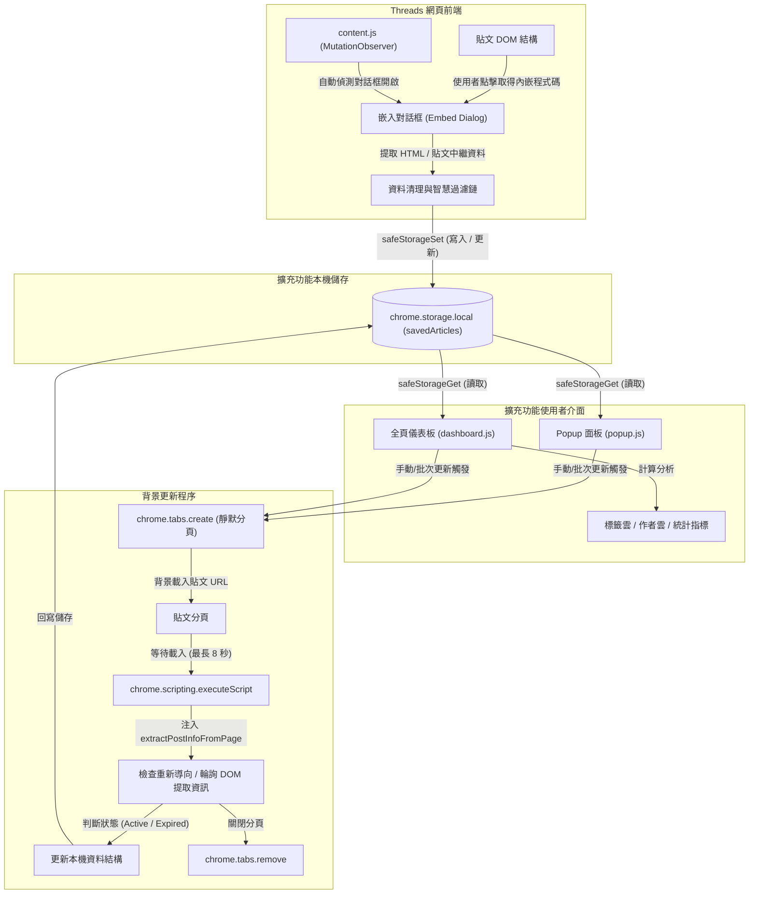

<div align="center">

# Threads 程式碼儲存器 (Threads Code Saver)

**自動擷取、清理、管理與匯出 Threads 貼文中的可嵌入程式碼與中繼資料**

[](./manifest.json)
[](https://developer.chrome.com/docs/extensions/mv3/intro/)
[](./LICENSE)
[](#技術規格與技術棧)
[](#開發與前置條件)

---

基於 Google Chrome Manifest V3 標準設計的瀏覽器擴充功能。  
純前端、零依賴 — 所有資料安全儲存於瀏覽器本機的 `chrome.storage.local`，  
無需任何後端服務、外部資料庫或 API 金鑰，確保您的隱私與資料安全。

</div>

---

## 目錄

- [快速開始](#快速開始)
- [核心功能特性](#核心功能特性)
- [技術規格與技術棧](#技術規格與技術棧)
- [專案目錄結構](#專案目錄結構)
- [系統架構與流程圖](#系統架構與流程圖)
- [核心技術邏輯與演算法](#核心技術邏輯與演算法)
- [資料儲存 Schema](#資料儲存-schema)
- [配置與權限宣告](#配置與權限宣告)
- [備份與匯出格式規範](#備份與匯出格式規範)
- [疑難排解 FAQ](#疑難排解-faq)
- [開發與貢獻指南](#開發與貢獻指南)
- [Changelog](#changelog)
- [AI 友善文件說明](#ai-友善文件說明)
- [免責聲明](#免責聲明)

---

## 快速開始

### 開發與前置條件

- 支援 Manifest V3 的 Chromium 核心瀏覽器（如 Google Chrome, Microsoft Edge, Brave, Opera 等）。
- 執行與開發不需安裝任何額外的編譯套件。

### 載入擴充功能步驟

1. 複製或下載本專案原始碼到本機：
   ```bash
   git clone https://github.com/Scorpio-meow/threads-embedded-code.git
   cd threads-embedded-code
   ```
2. 開啟 Chromium 核心瀏覽器，導覽至擴充功能管理頁面：
   - Chrome 請輸入：`chrome://extensions/`
   - Edge 請輸入：`edge://extensions/`
3. 開啟頁面右上角的 **開發人員模式 (Developer mode)**。
4. 點擊左上角的 **載入未封裝項目 (Load unpacked)** 按鈕。
5. 選擇本專案的根目錄（即包含 [manifest.json](./manifest.json) 的資料夾）。
6. 建議在瀏覽器工具列中釘選「Threads 程式碼儲存器」圖示以利快速操作。

### 基本使用流程

1. 瀏覽至任意 Threads 貼文的單篇詳細頁面或動態牆。
2. 點擊貼文右上角的選單按鈕（三個點），並選擇「取得內嵌程式碼 (Get embed code)」。
3. 擴充功能會自動攔截產生的對話框並擷取資料。當頁面出現綠色的「內嵌程式碼已儲存」通知時，代表儲存成功。
4. 點擊瀏覽器工具列的擴充功能圖示可開啟 Popup 快速面板，或在選項中開啟 Dashboard 完整儀表板進行深入管理。

---

## 核心功能特性

### 1. 智慧攔截與自動儲存
- **DOM 變更監聽**：使用 `MutationObserver` 持續監控網頁結構，搭配 5 秒一次的週期性掃描，精確捕獲「取得內嵌程式碼」對話框。
- **主動式偵測**：當使用者在非擴充功能觸發的情況下開啟嵌入對話框時，[processOpenEmbedDialogs](./content.js#L402-L442) 會主動識別並將該貼文儲存至資料庫。
- **安全儲存封裝**：內建 [safeStorageGet](./content.js#L20-L31) 與 [safeStorageSet](./content.js#L32-L43)，能自動偵測擴充功能上下文是否失效（[isExtensionAlive](./content.js#L13-L19)），避免拋出未捕獲例外（Context Invalidated 錯誤）。

### 2. 智慧過濾與中繼資料擷取
- **原生排版與換行保留**：採用頂層容器 `innerText` 擷取演算法，完整保留段落換行（`\n`）與 `<br>` 標籤，解決傳統子節點拼接造成的換行遺失問題，同時確保同行的 `@提及` 與 `#標籤` 不被誤切為多行。
- **UI 與時間雜訊過濾**：自動識別並清除作者簡介、追蹤人數、串文數量、相對發文時間（如「2天」、「1小時」）以及平台引導文案（例如「查看 @... 參與的最新對話」、「尚無回覆」等）。支援多達 25 種以上的繁中與英文模式。
- **嚴格排除標頭連結**：深度過濾 `time` 標籤與 `a[href*="/post/"]` 貼文永久連結節點，杜絕發文時間被誤納入內文。
- **回覆邊界隔離**：在首頁動態牆或個人檔案頁面擷取貼文時，若偵測到「回覆...」等邊界元素，會自動切斷並排除回覆區域，僅保留原始貼文內容。
- **純圖片貼文偵測**：透過 [isLikelyImageOnlyDescription](./content.js#L171-L178) 智慧識別僅含圖片說明（如 `Photo by ... on ...`）的貼文，避免誤擷取無意義描述。

### 3. 多維度欄位提取
擴充功能會將每篇貼文拆解為結構化的欄位，以利後續的檢索與程式碼重複利用：

| 欄位名稱 | 說明 |
| :--- | :--- |
| **貼文內文** | 經過去除中繼資料與 UI 雜訊後的純文字貼文內容（保留原始換行與段落結構） |
| **作者帳號** | 提取發文者的帳號（`@username`） |
| **作者主頁連結** | 連結至發文者的 Threads 個人主頁 |
| **精確發布時間** | 包含 ISO 8601 格式時間與人類可讀的格式化時間 |
| **自動標籤群組** | 整合官方 Hashtag、程式語言關鍵字，並移除重複標籤 |
| **程式碼區塊** | 解析貼文中的行內程式碼、Markdown 程式碼圍欄及等寬字型 CSS 區塊 |
| **嵌入程式碼** | 儲存 Threads 官方原生的 blockquote HTML 內嵌碼 |

### 4. 背景更新與失效狀態監控
- **背景任務佇列**：使用 `chrome.tabs` 與 `chrome.scripting` 循序建立背景分頁，自動重新讀取貼文以同步最新內容與精確發布時間。
- **智慧失效標記**：當背景更新發現以下狀況時，會自動將貼文標記為失效（`expired`）：
  - `redirected`：URL 中的貼文 ID 發生改變（表示原貼文已被轉導或刪除）。
  - `post-not-found`：在頁面載入 8 秒後仍找不到貼文主容器 `[data-pressable-container]`。
  - `fallback-summary`：頁面僅剩下預設的引導摘要文字。
- **失效自動恢復**：下次更新時若偵測到貼文恢復可存取狀態，將會自動清除失效標記。

### 5. 雙檢視介面與批次操作
- **Popup 彈出面板**：提供快速檢索、全文搜尋、多維度排序、類型篩選、三種匯出格式、本機資料匯入與單筆更新/刪除。
- **Dashboard 完整儀表板**：全螢幕響應式排版，內建全選/反選批次操作（支援 Indeterminate 半選狀態）、批次刪除、批次複製 Embed 代碼、標籤統計雲與作者統計雲。
- **自訂互動 Modal**：所有具破壞性的敏感操作（如清除全部、批次刪除、覆寫匯入）均使用自訂 Modal 進行二次確認，完全替換原生的 `confirm()` 與 `alert()`，外觀與擴充功能設計語言高度統一。

---

## 技術規格與技術棧

- **核心架構**：原生 HTML5, CSS3, Vanilla JavaScript (ES6+)。
- **核心規範**：Chrome Extension Manifest V3。
- **資料儲存**：`chrome.storage.local`（儲存上限預設為 10MB）。
- **權限控制**：完全無第三方依賴，不使用任何外部 CDN 或 npm 套件，符合安全性嚴格的內容安全政策 (Content Security Policy, CSP)。

---

## 專案目錄結構

專案的所有主要檔案及其對應的實作細節如下所示。您可以點擊檔案名稱直接開啟檢視：

- [manifest.json](./manifest.json)：擴充功能設定檔，定義權限、腳本注入規則與進入點。
- [content.js](./content.js)：Content Script，負責 DOM 監聽、對話框攔截與初次資料提取。
- [styles.css](./styles.css)：注入到 Threads 網頁的樣式表，用於提示通知元件的渲染。
- [popup.html](./popup.html)：瀏覽器工具列彈出視窗的 HTML 結構。
- [popup.css](./popup.css)：彈出視窗的專用樣式表。
- [popup.js](./popup.js)：彈出視窗控制邏輯（搜尋、排序、篩選、基本備份、背景更新）。
- [dashboard.html](./dashboard.html)：完整管理儀表板的 HTML 結構（包含統計數據、標籤雲、貼文列表、確認對話框等）。
- [dashboard.css](./dashboard.css)：儀表板的專用樣式表。
- [dashboard.js](./dashboard.js)：儀表板控制邏輯（統計分析、標籤雲與作者雲、自訂對話框、批次管理）。
- [favicon.png](./favicon.png)：擴充功能的圖示資源。
- [README.md](./README.md)（本檔案）。

---

## 系統架構與流程圖

下圖展示了從前端 Threads 頁面點擊按鈕，到背景更新，再到資料呈現於 UI 的完整運作路徑：



---

## 核心技術邏輯與演算法

### 1. 頂層文字容器排版擷取演算法 (Container InnerText Extractor)

為了避免將內文字串中的換行誤清理為單一空格，[content.js](./content.js#L69-L119)、[popup.js](./popup.js#L295-L335) 與 [dashboard.js](./dashboard.js#L940-L980) 採用頂層文字容器鎖定策略：

1. **定位候選容器**：選取 `span[class*="xo1l8bm"][dir="auto"]`、`span[class*="xi7mnp6"][dir="auto"]` 及 `div[dir="auto"]` 等主內容區塊。
2. **嚴格過濾時間與標頭節點**：
   - 排除 `time` 標籤本身及其父容器（`closest('time') || querySelector('time')`）。
   - 排除貼文固定網址標籤（`a[href*="/post/"]`、`a[href*="/t/"]`）。
   - 排除純作者標頭連結（`a[href*="/@"]`）。
3. **頂層去重 (Top-level Deduplication)**：僅保留未被其他候選容器包含的最頂層容器，防止子節點文字重複出現。
4. **原生排版輸出**：直接調用 `innerText.trim()`，保留 `<br>` 與天然段落換行，最後以 `\n\n` 自然拼接各獨立段落。

### 2. 嵌入碼權重排名演算法 (Dialog Weight Scorer)

當 Threads 彈出嵌入對話框時，為了準確拿到包含 `blockquote` 的完整嵌入碼，[extractEmbedCodeFromDialog](./content.js#L341-L370) 對所有 `readonly` 的輸入框內容進行權重計分：

```javascript
let score = value.length;
if (/data-text-post-permalink=/i.test(value)) score += 1000;
if (/<blockquote/i.test(value)) score += 500;
if (/threads\.com/i.test(value)) score += 100;
```
最後挑選分數最高的輸入框內容作為最佳的 `embedCode`，從而避免誤擷取為純 URL 或其他非完整的嵌入程式碼。

### 3. 程式碼區塊識別機制 (Code Block Detection)

擴充功能透過 [extractCodeBlocks](./content.js#L565-L615) 組合多種機制來自動識別並提取貼文中的程式碼片段：

- **Markdown 圍欄程式碼區塊**：使用正規表達式 ``/```(\w*)\n([\s\S]*?)```/g`` 匹配。若有指定語言標記（例如 ````javascript ... ````），則自動解析為對應語言。
- **Monospace 字型樣式區塊**：尋找 DOM 中包含 `style*="monospace"` 屬性的元素，將其文字內容去重後加入。
- **HTML 程式碼標籤**：選取 `pre` 或 `code` 元素，並過濾長度大於 5 個字元的內容。
- **行內程式碼**：使用 ``/`([^`\n]{2,})`/g`` 正規表達式提取所有行內程式碼，並將其合併為 `inline` 類型。

### 4. 背景佇列控制 (Background Queue Control)

當用戶點擊「更新貼文資料」時，為了防止開啟過多靜默分頁造成系統效能低落或觸發 Threads 流量限制，系統在 [popup.js](./popup.js#L69-L130) 與 [dashboard.js](./dashboard.js#L729-L789) 中限制為一篇一篇循序（Sequential）更新。更新的先後順序與範圍會依照目前畫面上已套用的篩選與排序結果（即 `filteredArticles`）進行。
更新模組會以非同步迴圈依序處理任務佇列：

```javascript
for (const article of articlesNeedingUpdate) {
  // 執行分頁建立、載入等待、腳本注入與資料比對
}
```

### 5. UI 與時間雜訊智慧過濾機制 (UI Noise Filtering)

為了獲取乾淨的貼文文字，[isLikelyThreadsFallbackDescription](./content.js#L120-L152) 提供了一系列的正規表達式過濾鏈，用以排除頁面中無關的 UI 輔助文字、相對時間標籤、粉絲數、瀏覽數、以及按鈕文字：

```javascript
return [
  /\d[\d,.]*\s*(?:萬|千)?次?瀏覽/i,
  /^回覆[\s\S]*[…\.]{1,3}$/i,
  /^尚無回覆$/i,
  /^查看動態$/i,
  /^更多$/i,
  /^返回$/i,
  /^直欄標題$/i,
  /^附加影音內容$/i,
  /^新增 GIF$/i,
  /^展開撰寫工具$/i,
  /^分享$/i,
  /^轉發$/i,
  /^讚$/i,
  /^為你推薦$/,
  /^新串文$/,
  /^搜尋$/,
  /^動態$/,
  /^個人檔案$/,
  /^聯邦宇宙$/,
  /^洞察報告$/,
  /^已儲存$/,
  /^追蹤中$/,
  /^附帶原始貼文的回覆內容$/,
  /\d[\d,.]*\s*位粉絲\s*•\s*\d[\d,.]*\s*則串文/i,
  /\d[\d,.]*\s*followers\s*•\s*\d[\d,.]*\s*threads/i,
  /查看\s*@.+\s*參與的最新對話/i,
  /See\s*what\s*@.+\s*is\s*saying\s*on\s*Threads/i,
  /在貼文中提及\s*@meta\.ai\s*，即可在這裡獲得解答/i,
  /^\d+\s*(?:秒|分|分鐘|小時|天|週|年|s|m|h|d|w|y)(?:前)?$/i,
  /^\d{1,2}\s*月\s*\d{1,2}\s*日$/i,
  /^\d{4}\s*年\s*\d{1,2}\s*月\s*\d{1,2}\s*日$/i,
  /^[A-Z][a-z]{2}\s+\d{1,2}(?:,\s*\d{4})?$/i,
  /^(?:剛剛|昨天|前天|yesterday|just now)$/i
].some(pattern => pattern.test(normalizedText));
```

### 6. 智慧標籤映射與自動偵測

除了直接擷取貼文中的標籤（Hashtag）之外，[extractTags](./content.js#L637-L683) 還會對貼文內文進行語境掃描，比對預設的程式語言與技術關鍵字（如 JavaScript, TypeScript, Python, React, Vue, CSS 等），將其自動轉換為對應的分類標籤，提升後續檢索的精確度。

---

## 資料儲存 Schema

所有儲存的貼文皆以 `SavedArticle` 物件陣列形式儲存在本機的 `chrome.storage.local`。

### SavedArticle 介面定義

```typescript
interface SavedArticle {
  /** 唯一識別碼 (格式為 embed_[時間戳]_[隨機字串] 或 code_[時間戳]_[隨機字串]) */
  id: string;

  /** 貼文唯一 URL，作為本機去重與更新的主鍵 */
  postLink: string;

  /** Threads 官方完整 blockquote HTML 內嵌碼 */
  embedCode: string;

  /** 原始發布時間 (ISO 8601 格式) */
  timestamp: string;

  /** 原始發布時間的格式化標題 (如「2026年5月29日 上午10:00」) */
  timestampTitle: string;

  /** 儲存至本機的時間 (ISO 8601 格式) */
  savedAt: string;

  /** 貼文純文字 (已過濾 UI 雜訊) */
  content: string;

  /** 發文者帳號 */
  author: string;

  /** 發文者 Threads 個人檔案網址 */
  authorUrl: string;

  /** 自動推導的標籤陣列 */
  tags: string[];

  /** 解析出的程式碼區塊列表 */
  codeBlocks: CodeBlock[];

  /** 程式碼區塊總數 */
  codeCount: number;

  /** 貼文存活狀態 */
  status: 'active' | 'expired';

  /** 最後被背景更新的時間 (ISO 8601) */
  lastUpdated?: string;

  /** 標記失效的時間 (ISO 8601) */
  expiredAt?: string;

  /** 失效原因 */
  expiredReason?: 'redirected' | 'post-not-found' | 'fallback-summary';

  /** 最後一次檢查失效狀態的時間 (ISO 8601) */
  expiredCheckedAt?: string;

  /** 最後更新時間戳記的系統時間 */
  timestampUpdatedAt?: string;

  /** 匯入來源標記 */
  importedFrom?: 'full-data-file' | 'js-embed-file';
}
```

### CodeBlock 介面定義

```typescript
interface CodeBlock {
  /** 來源類型：markdown圍欄、HTML標籤、Monospace樣式或行內程式碼 */
  type: 'markdown_block' | 'html_tag' | 'monospace' | 'inline';

  /** 程式碼文字內容 */
  code: string;

  /** 推測的程式語言 (無法識別時為 unknown) */
  language: string;

  /** 在貼文中的順序索引 (由 1 開始) */
  index: number;

  /** 行內代碼總數 (僅 inline 類型有效) */
  count?: number;
}
```

---

## 配置與權限宣告

本擴充功能在 [manifest.json](./manifest.json) 中聲明了最低限度的必要權限，絕無多餘的後門或敏感權限需求：

| 權限名稱 | 類型 | 說明與用途 |
| :--- | :--- | :--- |
| `storage` | API 權限 | 用於將貼文資料與設定讀寫至本機瀏覽器的 `chrome.storage.local` 空間。 |
| `tabs` | API 權限 | 用於在背景安靜地開啟 Threads 網頁分頁，以執行資料更新與失效驗證。 |
| `scripting` | API 權限 | 用於向背景載入的 Threads 貼文分頁注入內容提取腳本。 |
| `https://www.threads.com/*` | 主機權限 | 僅允許擴充功能在標準 Threads 網域中注入 content.js 並讀取貼文內容。 |
| `https://threads.com/*` | 主機權限 | 允許擴充功能在非 www 前綴的 Threads 網域中進行相同操作。 |

---

## 備份與匯出格式規範

本工具提供三種不同用途的 JavaScript 陣列格式匯出，檔案會以 `const posts = [...]` 的結構輸出，以便外部系統或網頁直接引用。

### 匯出格式對比

| 格式名稱 | 檔案命名規範 | 主要用途與特點 |
| :--- | :--- | :--- |
| **簡易版嵌入碼 (Embed Only)** | `threads-embed-codes-[YYYY-MM-DD].js` | 專為靜態網頁快速嵌入設計，自動去除重複的 script 標籤並轉義單引號。 |
| **精選貼文資料 (Featured Data)** | `threads-featured-data-[YYYY-MM-DD].js` | 提供給外部客製化展示網頁，author 欄位會自動移除 `@` 前綴以方便作為 API Key 使用。 |
| **完整版資料 (Full Data)** | `threads-full-data-[YYYY-MM-DD].js` | 包含所有本機資料結構，適用於跨裝置備份、完整資料轉移或開發調試。 |

### 範例格式說明

#### 1. 簡易版嵌入碼
```javascript
const posts = [
  '<blockquote class="text-post-media" data-text-post-permalink="https://www.threads.com/@user/post/x">...</blockquote>',
  '<blockquote class="text-post-media" data-text-post-permalink="https://www.threads.com/@user/post/y">...</blockquote>'
];
```

#### 2. 精選貼文資料
```javascript
const posts = [
  {
    "embedCode": "<blockquote class=\"text-post-media\" data-text-post-permalink=\"https://www.threads.com/@user/post/x\">...</blockquote>",
    "postLink": "https://www.threads.com/@user/post/x",
    "author": "user",
    "content": "貼文純文字內容...",
    "tags": ["JavaScript", "CSS"]
  }
];
```

#### 3. 完整版資料
```javascript
const posts = [
  {
    "id": "embed_1716960000000_abc123xyz",
    "postLink": "https://www.threads.com/@user/post/x",
    "embedCode": "<blockquote class=\"text-post-media\" ...>...</blockquote>",
    "timestamp": "2026-05-29T02:00:00.000Z",
    "timestampTitle": "2026年5月29日 上午10:00",
    "savedAt": "2026-05-29T02:10:00.000Z",
    "content": "貼文純文字內容",
    "author": "@user",
    "authorUrl": "https://www.threads.com/@user",
    "tags": ["JavaScript"],
    "codeBlocks": [],
    "codeCount": 0,
    "status": "active"
  }
];
```

### 智慧匯入模式 (Smart Import)

當匯入備份檔案時，系統會開啟自訂的控制面板 Modal 供您選擇匯入策略：

> [!IMPORTANT]
> - **合併資料 (Merge)**：進行貼文去重。若該貼文已存在於本機儲存，則略過該筆匯入，僅將新貼文追加至清單最前端。
> - **完全覆寫 (Overwrite)**：直接清空現有的本機資料，完全以匯入檔案中的內容取代，且該操作為不可逆。

本擴充功能的匯入解析器具備極高的格式容錯能力，能依序嘗試 `JSON.parse`、`new Function()` 動態求值以及正規表達式提取，可完美相容標準 JSON 及帶有 `const posts =` 等自訂變數宣告前綴的 JavaScript 腳本。

---

## 疑難排解 FAQ

> [!WARNING]
> **問題：點擊取得內嵌程式碼後，網頁上沒有出現「儲存成功」的提示？**
> - 請確認瀏覽器是否已登入 Threads 帳號。未登入狀態下，Threads 官方對話框可能無法正確產生內嵌代碼。
> - 確認當前頁面網址是否為標準的 `threads.com` 或 `www.threads.com` 網域。
> - 若瀏覽器開發者主控台出現 `Extension context invalidated` 警告，此為 Chrome 重新載入擴充功能後的常見安全機制，只需重新整理對應的 Threads 網頁即可恢復運作。

> [!NOTE]
> **問題：為什麼有些貼文在背景更新後被標記為「失效貼文」？**
> - 這代表貼文可能已被原作者刪除、帳號被設為私密，或原作者封鎖了匿名存取。
> - 背景分頁的網路連線逾時（預設為 8 秒）也會導致暫時性無法讀取，因而判定為失效。
> - 若貼文隨後恢復正常，在下一次更新時，系統偵測到內容便會自動將其回復為 `active` 狀態。

> [!CAUTION]
> **問題：Threads 官方改版後，擴充功能無法正常擷取？**
> - 本工具高度依賴 Threads 前端網頁的 DOM 選擇器特徵（例如特定編碼的 class 類別）。
> - 若 Threads 官方進行了重大的結構或樣式修改，將會導致擷取演算法失效。此時請將問題提交至 GitHub Issue，我們將會盡快更新 [content.js](./content.js) 中對應的 CSS 選擇器。

> [!IMPORTANT]
> **問題：本機儲存空間是否有限制？**
> - `chrome.storage.local` 在多數 Chromium 瀏覽器中預設有 **10MB** 的配額限制。
> - 當儲存空間接近上限並拋出 `QUOTA_BYTES_EXCEEDED` 錯誤時，擴充功能會提示您清理。建議定期將完整版資料匯出備份，並清除不需要的舊貼文。

---

## 開發與貢獻指南

歡迎所有開發者協助改進本專案！如果您有任何建議或發現 Bug，請隨時提交 Issue 或 Pull Request。

### 開發注意事項與限制

- **零依賴原則**：專案保持原生輕量化設計，請勿引入任何npm 依賴套件或外部 CDN 框架。
- **嚴格 CSP 相容**：所有 HTML 頁面及注入的指令皆**禁止使用行內樣式 (inline style) 與行內事件監聽器**（例如 `onclick="..."`），必須使用 `addEventListener` 進行綁定。
- **欄位擴展**：若在 [content.js](./content.js) 中新增或修改了儲存欄位，請務必同步更新本 README 的 [資料儲存 Schema](#資料儲存-schema) 區段。

---

## Changelog

本專案遵循 Keep a Changelog 格式規範。

### [Unreleased]

#### 新增
- 實作頂層文字容器 `innerText` 排版擷取演算法，解決過往使用 `\s+` 壓平換行導致多行排版遺失的問題，完整保留段落換行、`<br>` 標籤及 Markdown 代碼區塊格式。

#### 改善
- 強化發文時間與標頭連結過濾：嚴格排除 `time` 標籤與 `a[href*="/post/"]`、`a[href*="/t/"]` 貼文固定網址節點，徹底杜絕發文時間誤納入內文。
- 擴充時間雜訊正規表達式：支援辨識並剔除相對時間字串（如「2天」、「1小時」、「剛剛」、「昨天」等）。
- 優化背景更新貼文資料的順序，使其依照目前畫面上的排序與篩選結果依序更新（[popup.js](./popup.js#L69) 與 [dashboard.js](./dashboard.js#L729)）。

### [2.0.5] - 2026-07-06
#### 新增
- 實作 [safeStorageGet](./content.js#L20-L31) 與 [safeStorageSet](./content.js#L32-L43) 封裝，防止 context invalidated 後未捕獲的例外中斷腳本執行。
- 支援 [processOpenEmbedDialogs](./content.js#L402-L442) 主動偵測機制，即使用戶未透過擴充功能按鈕開啟嵌入對話框也能成功擷取。

#### 改善
- 擴充過濾規則至 20 種以上的 UI 雜訊模式，並新增英文語系介面的過濾規則。
- 優化背景併發更新佇列的超時處理與重試邏輯。

#### 修正
- 修正 `isSameThreadsPostLink` 在特定自訂貼文 URL 格式下的誤判問題。
- 修正批次刪除完成後，全選核取方塊的半選 (indeterminate) 狀態未正確重置的異常。

### [2.0.0] - 2026-06-21
#### 新增
- 上線全網頁版儀表板 (Dashboard UI)。
- 支援三種匯出格式：簡易嵌入碼、精選貼文資料、完整版資料。
- 支援最多 3 個併發任務的背景分頁自動更新與失效智慧標記。
- 新增 Top 15 標籤統計雲與作者統計雲。
- 實作自訂確認 Modal，全面替換原生 `confirm()`。

#### 改善
- 嵌入碼對話框掃描改用分數權重演算法，大幅降低誤選率。
- 全面移除行內樣式，相容瀏覽器嚴格 CSP。

---

## AI 友善文件說明

本區段提供給 AI 代理、LLM 網頁爬蟲與 RAG 索引工具快速讀取本專案結構。

```markdown
# Threads 程式碼儲存器
> Chromium 核心瀏覽器擴充功能，用於從 Threads 貼文自動擷取並本機儲存可嵌入的程式碼與貼文中繼資料。

## 核心檔案路徑
- [manifest.json](./manifest.json): 擴充功能配置檔，定義權限與 content script 規則
- [content.js](./content.js): Content Script，負責監聽 DOM 變更與擷取嵌入對話框
- [styles.css](./styles.css): 注入至 Threads 頁面的通知樣式
- [popup.js](./popup.js): Popup 視窗邏輯，處理基本的搜尋、排序、更新與資料備份
- [dashboard.js](./dashboard.js): 儀表板頁面邏輯，包含標籤/作者統計雲與批次維護工具

## 核心資料定義
- savedArticles: chrome.storage.local 中的鍵名，儲存 SavedArticle 的物件陣列
- postLink: 去重與更新的主鍵
- embedCode: Threads 官方 <blockquote> HTML 嵌入程式碼
- status: active | expired，標記貼文的可存取狀態
```

---

## 免責聲明

本擴充功能為第三方獨立開發之開源工具，與 Meta 或 Threads 官方無任何關聯、授權或隸屬關係。Threads 平台的網頁結構、API 與使用規範可能隨時變更，若因官方平台改版導致擷取功能暫時失效，需等待維護者更新選擇器規則。使用者須自行承擔使用本工具之相關風險。

---

<div align="center">

**Threads 程式碼儲存器** — 由 [Scorpio-meow](https://github.com/Scorpio-meow) 開發與維護

</div>