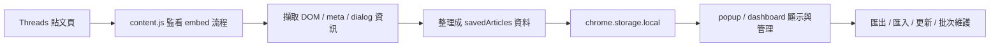

# Threads 程式碼儲存器

> 一個 Manifest V3 瀏覽器擴充功能，專門從 [Threads](https://www.threads.com/) 貼文自動擷取、儲存、管理與匯出可嵌入的程式碼與貼文資料。  
> 所有資料都保存在瀏覽器本機 `chrome.storage.local`，不需要後端、資料庫或額外 API。

## 這個專案能做什麼

- 在 Threads 貼文的「取得內嵌程式碼」流程上，自動攔截並儲存資料
- 自動整理貼文連結、作者、發文時間、內文、標籤、程式碼區塊與 embed code
- 偵測失效貼文、重新導向與 fallback summary，避免把錯誤內容當成正常貼文
- 提供 popup 快速檢視與全頁 dashboard 深度管理兩種介面
- 支援搜尋、排序、篩選、批次操作、匯出、匯入與重新生成 embed code

## 主要功能

### 自動擷取與儲存

- 監看 Threads 頁面中可觸發 embed code 的按鈕與對話框
- 盡可能從貼文 DOM、embed 對話框與 meta 資訊中補齊資料
- 儲存時會自動去重，同一篇貼文以 `postLink` 更新既有紀錄，不會無限重複新增
- 自動抽取：
   - 貼文內文
   - 作者與作者連結
   - 發文時間與時間標題
   - 程式碼區塊與推測語言
   - Hashtag 與技術關鍵字標籤
   - 原始 embed code

### 管理與瀏覽

- 全文搜尋：內文、程式碼、作者、標籤、embed code
- 排序：儲存時間、發文時間、作者、程式碼數量
- 篩選：全部、作者、標籤、無發文時間、失效貼文
- 標籤雲與快速統計
- 單篇刪除、批次刪除、清除全部資料

### 匯出與匯入

- 匯出簡易版 JS：只包含可直接嵌入的 `blockquote` 內容
- 匯出完整資料 JS：包含貼文可攜用的完整欄位
- 支援匯入 `.json` 與 `.js`
- 匯入時可選擇合併或覆寫

### 維護工具

- 重新生成 embed code
- 透過背景分頁重新抓取 Threads 貼文內容與時間
- 自動標記 redirect、post-not-found、fallback-summary 等失效狀態
- 提供本機備份與匯出以便長期保存

## 介面概覽

| 介面 | 用途 |
| --- | --- |
| `popup.html` | 工具列快速面板，用來快速搜尋、匯出、匯入與進入儀表板 |
| `dashboard.html` | 全頁控制面板，適合大量資料管理、批次操作與維護 |
| `content.js` | 注入 Threads 頁面，負責擷取與儲存資料 |
| `styles.css` | Threads 頁面上的輔助樣式 |

## 技術棧

- **語言**：JavaScript
- **標記語言**：HTML
- **樣式**：CSS
- **擴充功能規範**：Chrome Extension Manifest V3
- **瀏覽器 API**：`chrome.storage.local`、`chrome.tabs`、`chrome.scripting`
- **執行模式**：純前端、本機儲存，沒有後端服務

## 專案結構

```text
threads-embedded-code/
├── manifest.json      # MV3 設定、權限與入口定義
├── content.js         # 注入 Threads 頁面，擷取貼文與 embed 資料
├── styles.css         # 注入 Threads 頁面的輔助樣式
├── popup.html         # 工具列彈出視窗 UI
├── popup.css          # 工具列彈出視窗樣式
├── popup.js           # popup 互動邏輯：搜尋、匯出、匯入、快速管理
├── dashboard.html     # 全頁控制面板 UI
├── dashboard.css      # 全頁控制面板樣式
├── dashboard.js       # 深度管理邏輯：批次操作、統計、更新、刪除
├── favicon.png        # 擴充功能圖示
└── README.md          # 專案說明文件
```

## 安裝與啟用

### 1. 取得專案

```bash
git clone https://github.com/Scorpio-meow/threads-embedded-code.git
```

### 2. 開啟瀏覽器擴充功能頁面

- **Google Chrome**：`chrome://extensions/`
- **Microsoft Edge**：`edge://extensions/`
- **Brave / Opera / 其他 Chromium 瀏覽器**：使用相同的擴充功能管理頁

### 3. 開啟開發人員模式

在右上角切換 **開發人員模式**。

### 4. 載入未封裝項目

點擊 **載入未封裝項目**，選擇這個專案資料夾。

### 5. 釘選擴充功能

安裝完成後，建議把擴充功能釘選到工具列，方便快速開啟 popup 與 dashboard。

### 6. 更新程式後重新載入

修改檔案後，回到擴充功能頁面按 **重新載入**，再刷新 Threads 分頁。

> 這個專案不需要 `npm install`、`pnpm install` 或任何 build 步驟。

## 使用方式

### 快速儲存 Threads 貼文

1. 開啟 Threads 任一含程式碼的貼文
2. 點擊貼文選單中的 **取得內嵌程式碼**
3. 擴充功能會自動擷取並儲存資料
4. 若同一篇貼文再次被儲存，現有紀錄會被更新

### 在 popup 中快速管理

- 查看目前儲存數量
- 搜尋作者、內文、程式碼、標籤或 embed code
- 選取多筆資料進行匯出或操作
- 一鍵前往全頁儀表板

### 在 dashboard 中深度管理

- 使用全文搜尋、排序與篩選
- 檢視作者分布、標籤雲與快速統計
- 批次複製 embed code
- 批次重新生成 embed code
- 批次刪除選取文章
- 更新貼文時間與內容，並標記失效貼文

### 匯出與匯入

- 匯出 JS 備份時，可選擇：
   - **Embed Only**：只有可嵌入的 blockquote 內容
   - **Full Data**：包含完整貼文資料與失效資訊
- 匯入時支援：
   - `.json` 陣列
   - `{ savedArticles: [...] }`
   - `.js` 的 `const posts = [...]` 或 `posts = [...]`

## 工作流程



## 資料格式

### 本機儲存的資料樣貌

實際儲存在瀏覽器中的單筆資料大致如下：

```js
{
   id: "embed_...",
   postLink: "https://www.threads.com/@user/post/xxx",
   embedCode: "<blockquote ...>",
   timestamp: "2026-05-29T00:00:00.000Z",
   timestampTitle: "2026年5月29日",
   savedAt: "2026-05-29T00:00:00.000Z",
   content: "貼文內文...",
   author: "@username",
   authorUrl: "https://www.threads.com/@username",
   tags: ["JavaScript", "React"],
   codeBlocks: [
      {
         type: "markdown_block",
         code: "console.log('hello')",
         language: "javascript",
         index: 1
      }
   ],
   codeCount: 1,
   status: "active",
   expiredAt: "",
   expiredReason: "",
   expiredCheckedAt: ""
}
```

### 匯出的完整資料

完整匯出主要聚焦可攜性，欄位包含：

- `embedCode`
- `postLink`
- `author`
- `content`
- `timestamp`
- `timestampTitle`
- `savedAt`
- `tags`
- `status`
- `expiredAt`
- `expiredReason`
- `expiredCheckedAt`

> `codeBlocks` 與 `codeCount` 會保留在本機資料中，方便介面排序與分析。

## 權限與隱私

| 權限 | 用途 |
| --- | --- |
| `storage` | 本機保存貼文與 embed 資料 |
| `tabs` | 背景開啟 Threads 分頁以更新資料 |
| `scripting` | 對 Threads 頁面注入擷取邏輯 |
| `host_permissions` | 只存取 `threads.com` 與 `www.threads.com` |

- 本專案沒有伺服器端，也沒有把資料送到第三方服務
- 你的資料只會留在本機瀏覽器裡
- 若要搬機或重灌，請先匯出備份

## 開發與維護

- `content.js` 依賴 Threads 目前的 DOM 結構；Threads 改版後，選擇器可能要同步調整
- `dashboard.js` 會透過背景分頁重新抓取貼文，資料量大時建議分批操作
- 若按鈕或內容抓不到，先刷新 Threads 頁面，再重新載入擴充功能
- 修改 `popup.html`、`popup.css`、`dashboard.html`、`dashboard.css` 或 `content.js` 後，記得在擴充功能頁面重新載入

### 常見問題

**Q：沒有看到儲存按鈕或無法儲存？**

- 確認目前在 `threads.com` 或 `www.threads.com`
- 確認已登入 Threads
- 重新載入擴充功能並刷新頁面

**Q：更新資料後被標成失效？**

- 這通常表示貼文被重新導向、刪除，或頁面只剩 fallback summary

**Q：匯入失敗？**

- 檔案格式可能不是支援的 `.json` / `.js`
- `.js` 檔請使用 `posts = [...]` 或 `const posts = [...]`

**Q：Threads 改版後抓不到內容？**

- 這個專案高度依賴 Threads 的 DOM 與 aria/label 結構
- 需要更新 `content.js` 與 `dashboard.js` 的選擇器

## 版本資訊

- 目前版本：`v1.2.0`
- 擴充功能規範：Manifest V3

## 免責聲明

本擴充功能為非官方工具，與 Meta / Threads 無任何隸屬關係。Threads 的介面與 DOM 結構隨時可能變動，若擷取邏輯暫時失效，通常需要跟著 Threads 的更新調整選擇器。